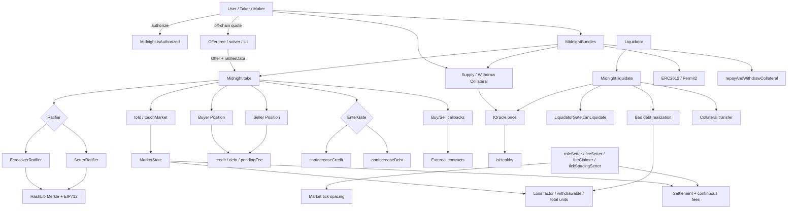
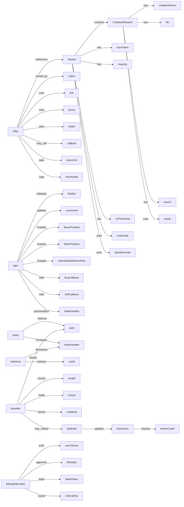
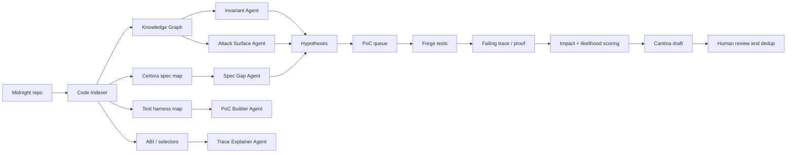

# Morpho Midnight — Agentic Security Knowledge Graph and Audit War Plan

This is a defensive security-research map for the Morpho Midnight smart-contract codebase. It is designed for competition-grade auditing: understand the protocol graph, classify contract bundles, identify trust boundaries, derive invariants, build reproducible Foundry PoCs, and convert only proven issues into high-quality Cantina submissions.

Status: research map, not confirmed findings.

## 1. Protocol mental model

Morpho Midnight is a non-custodial fixed-rate lending protocol organized around isolated, immutable, permissionlessly created fixed-maturity markets. Lending and borrowing are implemented through trading credit and debt units. Offers do not lock capital; liquidity is sourced when settlement/take paths execute.

```text
Market = loan token + collateral set + maturity + gates + RCF threshold
Offer  = maker quote over a market + side + tick price + group cap + ratifier + callback
Take   = loan-token transfer + buyer/seller credit/debt mutation + fee accounting
Repay  = debt reduction + withdrawable increase
Withdraw = credit burn + loan-token withdrawal
Liquidate = repayment or bad-debt realization + collateral seizure + lender socialized loss
```

The core audit theme is state/accounting correctness across delayed liquidity, fixed maturity, offer caps, callbacks, ratifiers, collateral/oracle health, bad debt, and periphery bundles.

## 2. Smart contract bundle categories

| Category | Files / contracts | Security purpose | Priority |
|---|---|---:|---:|
| Core protocol | `src/Midnight.sol` | Market creation, take, repay, withdraw, collateral, liquidate, fees, roles, flash loan, authorization | P0 |
| Public API/types | `src/interfaces/IMidnight.sol` | Market, Offer, MarketState, Position layouts and external entrypoints | P0 |
| Auth / offer validity | `src/ratifiers/EcrecoverRatifier.sol`, `src/ratifiers/SetterRatifier.sol`, `src/ratifiers/libraries/HashLib.sol` | Merkle offer proof, EIP-712 signature domain, root cancellation/ratification | P0 |
| Periphery router | `src/periphery/MidnightBundles.sol` | Multi-step UX flows: buy/sell targets, collateral supply/withdraw, repay, permits, referral fees | P0/P1 |
| Periphery math | `TakeAmountsLib.sol`, `ConsumableUnitsLib.sol` | Reverse assets↔units math for bundle target fills | P1 |
| Libraries | `UtilsLib.sol`, `TickLib.sol`, `SafeTransferLib.sol`, `IdLib.sol`, `ConstantsLib.sol`, `EventsLib.sol` | Math, tick price, token transfers, market-id encoding, events | P0/P1 |
| Gates | `IGate.sol` | Entry/liquidator access-control surfaces | P1 |
| Callbacks | `ICallbacks.sol` | Buy/sell/repay/liquidate/flash-loan external call surfaces | P0 |
| Certora | `certora/**` | Existing proof boundary and spec-gap discovery | P0 |
| Tests | `test/**`, especially `BaseTest.sol` | PoC harness and state-construction helpers | P0 |
| Audits | `audits/**` | Deduplication and accepted-risk review | P1 |

## 3. Architecture diagram



## 4. Knowledge graph



## 5. Machine-readable graph triples

```yaml
nodes:
  - Midnight
  - Market
  - Offer
  - Position
  - MarketState
  - Ratifier
  - Gate
  - Oracle
  - Callback
  - BundleRouter
  - LoanToken
  - CollateralToken
  - Liquidator
  - FeeRoles

edges:
  - Midnight.touchMarket -> creates_if_absent -> MarketState
  - Market -> identified_by -> toId(Market, INITIAL_CHAIN_ID)
  - Offer -> embeds -> Market
  - Offer -> constrained_by -> maxUnits_or_maxAssets
  - Offer -> authenticated_by -> Ratifier.isRatified
  - Ratifier -> validates -> MerkleProof
  - EcrecoverRatifier -> validates -> EIP712Signature
  - SetterRatifier -> validates -> onchainRootFlag
  - take -> mutates -> consumed[maker][group]
  - take -> mutates -> position[id][buyer]
  - take -> mutates -> position[id][seller]
  - take -> transfers -> loanToken
  - take -> calls_external -> buyerCallback
  - take -> calls_external -> sellerCallback
  - take -> postcondition -> sellerHealthyOrLiquidationLocked
  - supplyCollateral -> activates -> collateralBitmap
  - withdrawCollateral -> requires -> isHealthy
  - isHealthy -> reads -> Oracle.price
  - liquidate -> reads -> allActivatedCollateralOracles
  - liquidate -> mutates -> badDebt/lossFactor/totalUnits/withdrawable
  - MidnightBundles -> depends_on -> Midnight authorization
  - MidnightBundles -> catches -> failedTakeAndSkips
  - MidnightBundles -> assumes -> sameMarketForAllTakes
  - flashLoan -> calls_external -> callback
  - feeSetter -> mutates -> settlementFee/continuousFee
```

## 6. Trust boundaries

| Boundary | Crossing | Verification questions |
|---|---|---|
| Off-chain offer tree → on-chain ratifier | `Offer + ratifierData` | Can cancellation, root ratification, EIP-712 domain, leaf index, or maker authorization be mismatched? |
| Delegated authorization | `isAuthorized[authorizer][authorized]` | Can a helper mutate too much: positions, roots, consumed caps, authorization? |
| Core → callback | buy/sell/repay/liquidate/flash callbacks | Are state-before-transfer and post-callback checks sufficient? |
| Core → token | ERC20 `transfer` / `transferFrom` | Do all accounting claims depend on documented token assumptions? |
| Core → oracle | `IOracle.price()` | Are zero, revert, stale, and extreme prices safely handled within stated assumptions? |
| Core → gates | `enterGate`, `liquidatorGate` | Can gate reverts create unintended liveness or liquidation blockage? |
| Periphery → core | `MidnightBundles` | Can skipped takes, target rounding, approvals, permits, or referral fees violate user min/max expectations? |
| Role actions → markets | fee/tick updates | Can changes create unfair fills, implicit cancellation, or broken accounting? |
| Maturity boundary | timestamp before/after maturity | Are debt-increase, settlement, and liquidation-mode transitions exact? |

## 7. High-value invariant checklist

### Accounting

1. `totalUnits` must stay economically consistent with credit, debt, repayments, fee credit, and bad debt.
2. `withdrawable` must not allow loan-token withdrawal beyond repay/liquidation/fee-compatible balances.
3. Settlement fee and continuous fee accounting must not be extractable through dust loops.
4. Bad debt socialization must slash lenders consistently and never over-realize loss.
5. `claimableSettlementFee`, `continuousFeeCredit`, and `withdrawable` must remain compatible with actual balances under compliant-token assumptions.

### Liquidation

1. Healthy borrowers must not be liquidatable before maturity.
2. Unhealthy borrowers must not be able to block liquidation except by documented assumptions.
3. Seized collateral and repaid units must respect `lif`, price, and RCF constraints.
4. Zero-input bad-debt realization must only be valid when debt is truly unrecoverable.
5. Post-maturity liquidation must not create free collateral extraction.

### Offer validity and authorization

1. Only maker-authorized ratifiers can validate maker offers.
2. Root cancellation/ratification affects exactly intended maker/root pairs.
3. Signed offers cannot replay across ratifier contract, chain, or altered market fields.
4. `consumed[maker][group]` cannot be bypassed via rounding, group mixing, or periphery conversion.
5. `reduceOnly` cannot increase maker credit/debt through side flips or callback state changes.

### Callback and reentrancy

1. External callbacks cannot leave seller unhealthy unless the intended liquidation lock condition applies.
2. Nested calls cannot bypass consumed caps, health checks, withdrawal accounting, or authorization rules.
3. State-before-transfer does not allow temporary credit/debt to be monetized.
4. Callback-funded trades cannot create payer/receiver confusion.

### Periphery bundles

1. Empty or malformed inputs should revert without side effects.
2. Catch-and-skip loops should not hide partial side effects that violate min/max constraints.
3. Referral fee math must be exact around rounding boundaries.
4. Permit tolerance should not create unintended pulls.
5. Approval residue should not create practical loss under supported tokens.

## 8. Prioritized research hypotheses

These are not findings. Convert them into findings only after a reproducible Foundry PoC or a complete mathematical proof.

| ID | Hypothesis | Target | Proof style | Severity if proven |
|---|---|---|---|---|
| H1 | Callback reentrancy around `take` state-before-transfer causes value extraction or broken health/cap invariant | `Midnight.take` | Foundry PoC with malicious callback | High/Critical if funds can be extracted |
| H2 | Zero-input liquidation can over-realize bad debt or slash lenders incorrectly | `Midnight.liquidate` | Unit PoC with controlled oracle/collateral | High if solvent debt is socialized |
| H3 | Oracle liveness/collateral activation can force liquidation blockage beyond documented assumptions | `supplyCollateral`, `isHealthy`, `liquidate` | PoC with reverting oracle and authorization path | Medium/High if forced on victims |
| H4 | Assets/units cap can be exceeded via rounding, settlement fee change, or tick boundary | `take`, `TakeAmountsLib`, `ConsumableUnitsLib` | Fuzz PoC | Medium/High depending loss |
| H5 | Bundle catch-and-skip plus referral fee/target fill breaks user guarantees | `MidnightBundles` | Periphery PoC | Medium if user loss |
| H6 | Authorization scope allows unintended root cancellation, position mutation, or delegated escalation | `setIsAuthorized`, ratifiers, bundles | Scenario PoC | Low–High depending trust model |
| H7 | Market ID and EIP-712 chain-id behavior creates fork/replay inconsistency with loss | `IdLib`, `EcrecoverRatifier` | Fork/model PoC | Usually Low unless loss proven |

## 9. Agentic Security Researcher architecture



## 10. `skills.sh` smart-contract-audit runner plan

Use a deterministic runner so the agent does not randomly browse files.

```bash
# Baseline
forge build
forge test -vvv

# Static surface extraction
mkdir -p audit
find src -name '*.sol' -maxdepth 4 | sort > audit/filelist.txt
forge inspect src/Midnight.sol:Midnight abi > audit/abi-Midnight.json
forge inspect src/periphery/MidnightBundles.sol:MidnightBundles abi > audit/abi-MidnightBundles.json

# High-risk grep
rg -n "delegatecall|call\(|transferFrom|safeTransfer|callback|isAuthorized|price\(|block.timestamp|unchecked|assembly|tstore|tload|mulDiv|try .*catch|ecrecover|permit" src test certora > audit/high-risk-grep.txt

# PoC runs
forge test --match-path 'test/poc/*.sol' -vvvv
forge test --match-test 'test_POC_' -vvvv --gas-report
```

Recommended `skills.sh` agent prompt:

```text
You are SmartContractAuditSkill for Morpho Midnight.
For every candidate, output:
1. target function and line range,
2. violated invariant,
3. setup requirements,
4. minimal Foundry test name,
5. expected failing assertion,
6. likely impact/likelihood,
7. dedup status against audits, comments, tests, and Certora.
Prioritize: Midnight.take, liquidate, withdraw/repay, authorization, ratifiers, bundles, token/oracle mocks.
Do not submit without a reproducible PoC or complete proof.
```

## 11. PoC harness structure

```text
test/poc/PoC_BaseMidnight.t.sol
  - deploy Midnight
  - deploy EcrecoverRatifier, SetterRatifier, MidnightBundles
  - deploy MockERC20 loan and collateral tokens
  - deploy MockOracle configurable as normal/zero/revert/extreme
  - helper: createMarket(single/multi collateral)
  - helper: createOffer(side, tick, caps, ratifier)
  - helper: authorize(user, contract)
  - helper: seed borrower/lender positions through real protocol paths

test/poc/PoC_TakeCallbacks.t.sol
  - malicious buy/sell callback
  - nested take/withdraw/repay/liquidate/authorize attempts
  - final accounting and health assertions

test/poc/PoC_LiquidationBadDebt.t.sol
  - zero-input liquidation
  - post-maturity vs pre-maturity
  - badDebt/lossFactor/totalUnits accounting

test/poc/PoC_RoundingCaps.t.sol
  - fuzz ticks, fees, units, caps
  - assert cap semantics and min/max expectations

test/poc/PoC_Bundles.t.sol
  - catch-and-skip behavior
  - referral fee exactness
  - mixed market and empty input behavior

test/poc/PoC_RatifiersAuth.t.sol
  - root cancellation/ratification
  - EIP-712 signer recovery
  - authorized signer edge cases
```

## 12. Cantina submission template

```markdown
## Summary
[One sentence: who can do what, against whom, causing what broken invariant or loss.]

## Finding Description
[Protocol guarantee. Target function/branch. Malicious input flow. Why checks do not stop it.]

## Impact Explanation
[Quantify funds/accounting/liveness impact. Explain severity selection.]

## Likelihood Explanation
[Prerequisites: permissionless call, market configuration, maturity timing, oracle/token/gate assumptions, user authorization.]

## Proof of Concept
[Foundry test path, command, failing assertion, trace summary.]

```bash
forge test --match-test test_POC_<Name> -vvvv
```

## Recommendation
[Minimal patch plus invariant regression test.]
```

## 13. Severity focus

Prioritize fewer, stronger submissions.

High/Critical candidates:
- Direct theft or collateral/loan-token drain.
- Unauthorized position mutation or collateral withdrawal.
- Bad-debt realization against solvent borrowers.
- Market-wide accounting corruption allowing over-withdrawal.
- Reentrancy that bypasses health/cap checks with profit.

Medium candidates:
- Reliable freezing of liquidation/withdrawal in normal markets.
- User loss through official periphery under realistic inputs.
- Offer cap or min/max violation causing bounded loss.
- Profitable rounding attack under realistic gas.

Low/Info candidates:
- Documented assumptions with no forced victim impact.
- Admin-only misconfiguration.
- Weird token behavior explicitly excluded by token safety requirements.
- UX-only revert with no fund/accounting impact.

## 14. Immediate execution order

1. Run `forge build` and `forge test -vvv`.
2. Read `test/BaseTest.sol`; clone setup into `test/poc/PoC_BaseMidnight.t.sol`.
3. Build mocks: `MockOracle`, `ReentrantCallback`, `BadERC20`, `GateMock`.
4. Start with `take` callback/reentrancy and liquidation bad-debt tests.
5. Add fuzzing for assets/units caps and bundle target-fill math.
6. Deduplicate every candidate against `audits/**`, comments in `Midnight.sol`, and `certora/README.md`.
7. Submit only if the PoC is reproducible and the violated invariant is clear.
