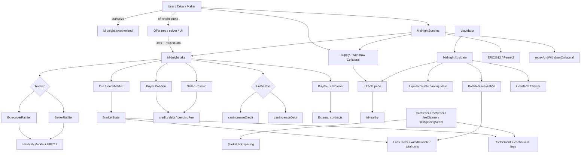
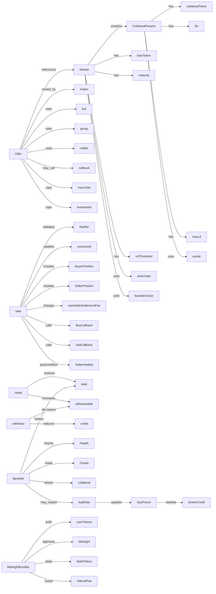
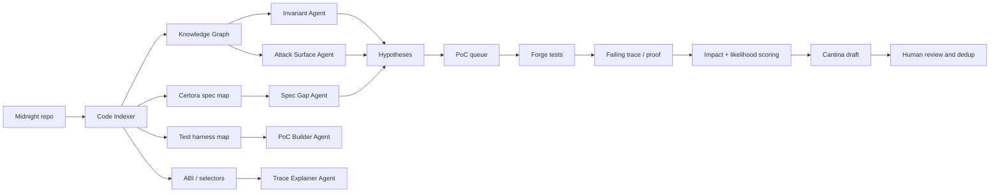

# DeFi Lending Protocol Interfaces — Hashlock AI Audit Consolidated Markdown

Source title: **DeFi Lending Protocol Interfaces**  
Source date shown in scan: **May 30, 2026**  
Scope shown in scan: **3 files, 15 issues found**  
Generated as: one combined Markdown file for the Morpho Midnight audit workspace.

> Important: this is based on an AI-generated Hashlock scan. Treat every issue as a hypothesis until proven against the real Midnight implementation and competition scope.

---

## Executive Summary

This scan covers the **integration interface layer** for Midnight:

- `IGate.sol`
- `IOracle.sol`
- `ICallbacks.sol`

The scan classifies the interface layer as a DeFi lending protocol integration surface with:

- gate access-control checks for increasing credit, increasing debt, and liquidations,
- oracle price feeds for collateral valuation,
- callback interfaces for buy, sell, repay, liquidate, and flash-loan flows.

From a competition perspective, most findings in this scan are **not automatically valid as standalone findings**, because an interface alone usually cannot enforce runtime safety. The real question is whether the **implementation contract** (`Midnight.sol`) already handles the risk. Therefore:

- callback reentrancy must be tested against `Midnight.take`, `Midnight.liquidate`, `Midnight.repay`, and `Midnight.flashLoan`;
- gate DoS must be checked against documented market design and whether gates are intentionally optional;
- oracle manipulation/staleness must be checked against market-level oracle assumptions and actual oracle implementations in scope;
- interface documentation, magic return values, and floating pragmas are likely Low/Info unless they cause measurable integration risk.

---

## Files in Scope

```text
src/interfaces/IGate.sol
src/interfaces/IOracle.sol
src/interfaces/ICallbacks.sol
```

---

## Access Control and External Dependency Map

### Privileged / trusted roles from scan

```text
1. EnterGate controller: decides canIncreaseCredit(account)
2. EnterGate controller: decides canIncreaseDebt(account)
3. LiquidatorGate controller: decides canLiquidate(account)
```

### External calls from scan

```text
IEnterGate.canIncreaseCredit
IEnterGate.canIncreaseDebt
ILiquidatorGate.canLiquidate
IOracle.price
IBuyCallback.onBuy
ISellCallback.onSell
ILiquidateCallback.onLiquidate
IRepayCallback.onRepay
IFlashLoanCallback.onFlashLoan
```

### External systems

```text
Oracle
Gate / whitelist system
Callback implementors
Flash-loan receivers
Liquidators
Market makers / takers
```

---

## Severity Summary from Scan

| Severity | Count |
|---|---:|
| Critical | 1 |
| High | 3 |
| Medium | 6 |
| Low | 4 |
| Informational | 1 |
| Total | 15 |

---

## Competition Triage

| Scan claim | Initial competition value | Why |
|---|---|---|
| Callback reentrancy risk | High priority to test, not yet a finding | Need prove real implementation ordering is exploitable. |
| Gate DoS / malicious gate | Usually design risk unless gate can be forced or breaks guarantee | Midnight explicitly supports optional gates; impact depends on market configuration. |
| Missing caller verification in callback implementations | Usually integrator-side issue | Interface cannot force implementors; valid only if official callbacks are vulnerable. |
| Oracle manipulation / staleness | High priority only if in-scope oracle implementation is weak | `IOracle.price()` alone is intentionally minimal. |
| Flash-loan array mismatch | Likely false positive if `Midnight.flashLoan` checks lengths | Must verify implementation. |
| Callback magic bytes not defined in interface | Low/Info unless integration break is material | Constants may be in `ConstantsLib`, not interface. |
| Floating pragmas | Low/Info | Often accepted for interfaces. |
| Missing NatSpec | Informational | Useful but rarely severity. |

---

## Findings from Current Scan

### Critical-01 — Reentrancy Risk via Callback Interfaces Without Enforced Guard Mechanism

**File:** `ICallbacks.sol`  
**Scan severity:** Critical  
**Research severity:** Unproven; test as High/Critical hypothesis against implementation.

#### Claim

Callback interfaces (`IBuyCallback`, `ISellCallback`, `ILiquidateCallback`, `IRepayCallback`, `IFlashLoanCallback`) allow external contracts to be called mid-execution. If the main protocol invokes callbacks before fully updating state or without reentrancy controls, malicious callbacks may re-enter the protocol.

#### Potential impact

- repeated flash loans,
- repeated liquidation attempts,
- state manipulation before settlement,
- bypass of checks relying on pre-update state,
- protocol fund loss if implementation is vulnerable.

#### Affected interface examples

```solidity
interface IBuyCallback {
    function onBuy(
        bytes32 id,
        Market memory market,
        uint256 buyerAssets,
        uint256 units,
        uint256 pendingFeeIncrease,
        address buyer,
        bytes memory data
    ) external returns (bytes32);
}

interface IFlashLoanCallback {
    function onFlashLoan(
        address caller,
        address[] memory tokens,
        uint256[] memory assets,
        bytes memory data
    ) external returns (bytes32);
}

interface ILiquidateCallback {
    function onLiquidate(
        address caller,
        bytes32 id,
        Market memory market,
        uint256 collateralIndex,
        uint256 seizedAssets,
        uint256 repaidUnits,
        address borrower,
        address receiver,
        bytes memory data,
        uint256 badDebt
    ) external returns (bytes32);
}
```

#### Deep audit analysis

This is the **most valuable item** in the scan, but the scan is incomplete because it looks only at the interface. The real audit must answer:

```text
Does Midnight update all sensitive state before callback?
Can callback re-enter a state-changing function and extract value?
Are post-callback checks sufficient?
Does flashLoan verify exact repayment after callback?
Does liquidation lock cover only seller liquidation or all dangerous nested flows?
```

#### PoC plan

Create `test/poc/PoC_CallbackReentrancy.t.sol` with malicious callbacks:

```text
1. Reenter take() during onBuy.
2. Reenter withdraw() during onBuy after credit mutation.
3. Reenter liquidate() during onSell / onLiquidate.
4. Reenter flashLoan() during onFlashLoan.
5. Assert no extra token balance, no duplicate collateral seizure, no broken totalUnits/lossFactor.
```

#### Likely final classification

- **High/Critical** only if value extraction or accounting corruption is proven.
- **Medium** if reliable protocol liveness/DoS is proven.
- **Invalid/Informational** if implementation already follows safe ordering and repayment checks.

---

### High-01 — Gate DoS Attack: Malicious or Broken Gate Contract Can Block Protocol Operations

**File:** `IGate.sol`  
**Scan severity:** High  
**Research severity:** Context-dependent.

#### Claim

A broken or malicious `IEnterGate` / `ILiquidatorGate` can revert or return false, blocking credit/debt increases or liquidations.

#### Deep audit analysis

This is likely a **known design tradeoff**, because gates are optional policy hooks. A market choosing a gate intentionally delegates access control/liveness to that gate. The finding becomes stronger only if:

```text
1. gate can be changed unexpectedly after market creation,
2. a third party can force a gate into a market,
3. gate failure blocks exits that should remain open,
4. liquidation blockage violates stated market guarantees,
5. liquidator gate prevents bad-debt realization in a way not disclosed.
```

#### PoC plan

```text
- Create market with malicious liquidatorGate.
- Borrow until undercollateralized.
- Make canLiquidate revert or return false.
- Prove no liquidation path can recover.
- Check if this is documented/intentional.
```

#### Likely final classification

Usually **Low/Medium design risk**, not High, unless it violates explicit guarantees or can be forced on users.

---

### High-02 — Missing Caller Verification in Callback Interfaces

**File:** `ICallbacks.sol`  
**Scan severity:** High  
**Research severity:** Usually integrator-side, not protocol-core.

#### Claim

Callback functions can be called directly by anyone unless callback implementations check `msg.sender`.

#### Deep audit analysis

This is true for almost every callback interface in DeFi. The interface cannot enforce `msg.sender == Midnight`; callback implementors must check it. This becomes competition-worthy only if there are **official callback contracts in scope** that trust parameters without verifying `msg.sender`.

#### PoC plan

```text
- Search official repo for contracts implementing IBuyCallback, ISellCallback, ILiquidateCallback, IRepayCallback, IFlashLoanCallback.
- If any exist, directly call the callback with forged params.
- Prove token transfer or state corruption.
```

#### Likely final classification

- **High/Medium** if official implementation loses funds.
- **Informational** if only third-party implementor guidance.

---

### High-03 — Oracle Price Manipulation via Flash Loan Attack

**File:** `IOracle.sol`  
**Scan severity:** High  
**Research severity:** Depends on oracle implementation, not interface alone.

#### Claim

`IOracle.price()` returns only a `uint256` and does not enforce TWAP/staleness/circuit breaker.

#### Deep audit analysis

The interface is intentionally generic. A minimal oracle interface is not necessarily vulnerable. The real bug must exist in an in-scope oracle implementation or in the core protocol’s assumptions.

Winning path:

```text
1. Find in-scope oracle implementation.
2. Prove it uses spot AMM or stale feed without checks.
3. Manipulate price.
4. Borrow more than collateral value or liquidate healthy position.
```

#### PoC plan

```text
- Mock spot oracle with manipulated price.
- Show core protocol behaves as expected under bad oracle.
- Then determine whether this oracle behavior is in scope or explicitly excluded.
```

#### Likely final classification

- **High** if official oracle is manipulable.
- **Invalid** if oracle implementation is out of scope or external assumption.

---

### Medium-01 — Flash Loan Multi-Token Array Length Mismatch Not Enforced at Interface Level

**File:** `ICallbacks.sol`  
**Scan severity:** Medium  
**Research severity:** Likely false positive against current implementation if checked.

#### Claim

`IFlashLoanCallback.onFlashLoan` accepts parallel arrays `tokens` and `assets`, and the interface does not enforce equal length.

#### Deep audit analysis

Interfaces cannot enforce array length. The real check must be in `Midnight.flashLoan`.

Validation checklist:

```text
- Does flashLoan require tokens.length == assets.length?
- Does it transfer every token before callback?
- Does it pull every token after callback?
- Does duplicate token behavior create a repayment/accounting issue?
- Does empty array behavior matter?
```

#### PoC plan

```text
- Call flashLoan with mismatched arrays.
- Expect revert before transfers.
- If not, test repayment bypass.
```

#### Likely final classification

Likely **Invalid** if implementation checks array lengths. Otherwise **High/Medium** if repayment bypass exists.

---

### Medium-02 — Missing Oracle Price Staleness Check in Interface Design

**File:** `IOracle.sol`  
**Scan severity:** Medium  
**Research severity:** Design/documentation unless implementation affected.

#### Claim

`price()` returns no timestamp or freshness metadata.

#### Deep audit analysis

This is a classic oracle-design issue but not enough as a standalone protocol bug. The protocol can require each `IOracle` implementation to handle staleness internally.

Audit question:

```text
Does Midnight state that IOracle.price() must be fresh/manipulation-resistant?
Are official oracle implementations in scope?
Can a market creator use arbitrary malicious oracle and harm other users?
```

#### Likely final classification

Usually **Low/Info** unless official oracle implementation is stale/manipulable.

---

### Medium-03 — Liquidation Monopoly via Restrictive LiquidatorGate

**File:** `IGate.sol`  
**Scan severity:** Medium  
**Research severity:** Context-dependent design risk.

#### Claim

Restrictive liquidator gates can delay or block liquidations, causing bad debt.

#### Deep audit analysis

This is related to High-01 but focuses on centralization/availability rather than outright malicious gate failure. Because Midnight markets are permissionlessly created and gates appear to be part of market configuration, this may be an accepted market-design risk.

Useful test:

```text
Can lenders/takers detect liquidatorGate before entering?
Is gate immutable in Market?
Can gate block bad-debt realization forever?
Is bad debt socialization dependent on liquidators being gated?
```

---

### Medium-04 — Callback Return Value Magic Bytes Not Defined in Interface

**File:** `ICallbacks.sol`  
**Scan severity:** Medium  
**Research severity:** Likely Low/Info.

#### Claim

The interface returns `bytes32` but does not define constants for expected magic return values.

#### Deep audit analysis

Check whether `ConstantsLib.sol` defines a shared `CALLBACK_SUCCESS`. If yes, this issue is mostly documentation/interface ergonomics.

Potential improvement:

```solidity
bytes32 constant CALLBACK_SUCCESS = keccak256("MidnightCallbackSuccess");
```

But if the protocol already imports a common constant, this is not a real security issue.

---

### Medium-05 — Market Struct Passed by Memory to Callbacks May Contain Stale State During Reentrancy

**File:** `ICallbacks.sol`  
**Scan severity:** Medium  
**Research severity:** Test with callback/reentrancy suite.

#### Claim

Callbacks receive `Market memory market`, which is a snapshot and can become inconsistent with storage during reentrancy.

#### Deep audit analysis

`Market` is mostly immutable market configuration, not mutable `MarketState`. Passing it by memory may be fine. The real risk is not the snapshot itself but whether callback implementors use it as trusted mutable state.

Test with:

```text
- nested callback reads toMarket(id)
- compare passed Market vs storage-decoded Market
- verify no mutable state is included in Market
```

Likely **Low/Info** unless a concrete official callback misuses it.

---

### Medium-06 — onLiquidate Exposes Bad Debt Amount Before Protocol Accounting

**File:** `ICallbacks.sol`  
**Scan severity:** Medium  
**Research severity:** Important to verify against `Midnight.liquidate`.

#### Claim

`onLiquidate` receives `badDebt`; liquidator may use it during callback to avoid loss or manipulate socialization.

#### Deep audit analysis

This is only valid if bad debt is not already applied before callback. In the actual `Midnight.liquidate` flow, verify ordering:

```text
1. calculate badDebt
2. update borrower debt
3. update market lossFactor / totalUnits / continuousFeeCredit
4. transfer collateral
5. call callback
6. pull repayment
```

If bad debt is already applied before callback, the scan’s front-run/socialization claim is weak. Still test reentrant withdrawal/updatePosition during `onLiquidate`.

---

### Low-01 — Floating Pragma Allows Unsafe Solidity Versions

**Files:** `IGate.sol`, `IOracle.sol`, `ICallbacks.sol`  
**Scan severity:** Low  
**Research severity:** Low/Info.

#### Claim

Interfaces use broad `pragma solidity >=0.5.0`.

#### Deep audit analysis

Broad pragmas in interfaces are common for compatibility, but security-sensitive repos often pin or narrow versions. This is not likely to win meaningful severity unless a concrete compiler mismatch causes a real issue.

---

### Low-02 — Floating Pragma in IOracle.sol

Same as Low-01, oracle-specific framing. Merge with Low-01 in any report to avoid duplicate spam.

---

### Low-03 — Floating Pragma in ICallbacks.sol

Same as Low-01, callback-specific framing. Merge with Low-01.

---

### Low-04 — IEnterGate Separates Credit and Debt Gates But Interface Allows Conflation

**File:** `IGate.sol`  
**Scan severity:** Low  
**Research severity:** Informational/design guidance.

#### Claim

A naive gate implementor may use the same whitelist for `canIncreaseCredit` and `canIncreaseDebt`.

#### Deep audit analysis

This is not a protocol vulnerability unless official gate implementation conflates the permissions and causes harm. Interface separation actually enables correct fine-grained control.

---

### Informational-01 — Missing NatSpec Documentation on Critical Interface Functions

**Files:** `IGate.sol`, `IOracle.sol`, `ICallbacks.sol`  
**Scan severity:** Informational  
**Research severity:** Informational.

#### Claim

Interfaces lack detailed NatSpec for callback magic values, oracle units, `pendingFeeIncrease`, `pendingFeeDecrease`, `collateralIndex`, and `badDebt`.

#### Deep audit analysis

This is a valid documentation-quality issue. For competition, submit only if low-severity/informational findings are in scope and after higher-severity work.

---

## Raw Current Scan Appendix

```text
5/30/2026

•

3 files

•

15 issues found

Disclaimer: This AI-generated scan may contain inaccuracies and false positives. For professional audits, consult Hashlock security audit experts.

DeFi Lending Protocol Interfaces

This is a set of Solidity interface files for a DeFi lending/borrowing protocol called 'Midnight' (by Morpho Association). The interfaces define the external contracts and callback mechanisms used by the protocol. The system includes: (1) Gate interfaces for access control (who can increase credit/debt and who can liquidate), (2) An oracle interface for price feeds, and (3) Callback interfaces for flash loans, buy/sell operations, liquidations, and repayments. Together, these interfaces form the integration surface of a collateralized lending market protocol.

Access Control
custom

Privileged Roles
1
EnterGate controller (canIncreaseCredit)
2
EnterGate controller (canIncreaseDebt)
3
LiquidatorGate controller (canLiquidate)

External Calls
1
IEnterGate
2
ILiquidatorGate
3
IOracle
4
IBuyCallback
5
ISellCallback
6
ILiquidateCallback
7
IRepayCallback
8
IFlashLoanCallback

External Systems
1
Oracle
2
Gate/Whitelist System

canIncreaseCredit
canIncreaseDebt
canLiquidate
price
onBuy
onSell
onLiquidate
onRepay
onFlashLoan

critical Severity
1
1

ICallbacks.sol
Reentrancy Risk via Callback Interfaces Without Enforced Guard Mechanism
The callback interfaces (IBuyCallback, ISellCallback, ILiquidateCallback, IRepayCallback, IFlashLoanCallback) all invoke external contracts mid-execution and pass sensitive market state information. The interface design itself does not enforce or suggest any reentrancy protection mechanism. The `onBuy` callback receives `buyerAssets` and `units` — if the main protocol has not yet updated its internal state before calling this callback, a malicious buyer contract could re-enter the protocol to perform additional buys, sells, or borrows using the pre-update state. Similarly, `onLiquidate` passes `seizedAssets` and `repaidUnits` — a malicious liquidator could re-enter to perform additional liquidations before the first one is fully settled. The `onFlashLoan` callback is particularly dangerous as it provides the caller with borrowed assets before repayment is verified, creating a window for reentrancy attacks. The `Market memory market` parameter passed to callbacks represents a snapshot of state at the time of the call. If the protocol's storage state has not been updated before the callback is invoked (violating checks-effects-interactions), the callback can re-enter and observe stale state, enabling double-spending or double-liquidation attacks.

Impact
A malicious callback contract could re-enter the main protocol during callback execution to: (1) drain funds via repeated flash loans, (2) perform multiple liquidations of the same position, (3) manipulate market state before it is properly updated, or (4) bypass access control checks that rely on state that hasn't been updated yet. This could lead to complete loss of protocol funds.
Scenario
// Malicious flash loan callback that reenters the protocol
contract MaliciousFlashLoanReceiver is IFlashLoanCallback {
    IMidnight public protocol;
    address[] tokens;
    uint256[] amounts;

    function attack() external {
        // Request flash loan
        protocol.flashLoan(tokens, amounts, "");
    }

    function onFlashLoan(
        address caller,
        address[] memory _tokens,
        uint256[] memory _assets,
        bytes memory data
    ) external returns (bytes32) {
        // Re-enter the protocol before repayment check
        // If protocol hasn't updated state yet, this succeeds
        protocol.flashLoan(tokens, amounts, ""); // Second flash loan

        // Repay first loan (but second loan funds are now held)
        // ...
        return keccak256("IFlashLoanCallback.onFlashLoan");
    }
}
Affected code
interface IBuyCallback {
function onBuy(bytes32 id, Market memory market, uint256 buyerAssets, uint256 units, uint256 pendingFeeIncrease, address buyer, bytes memory data) external returns (bytes32);
}

interface IFlashLoanCallback {
function onFlashLoan(address caller, address[] memory tokens, uint256[] memory assets, bytes memory data) external returns (bytes32);
}

interface ILiquidateCallback {
function onLiquidate(address caller, bytes32 id, Market memory market, uint256 collateralIndex, uint256 seizedAssets, uint256 repaidUnits, address borrower, address receiver, bytes memory data, uint256 badDebt) external returns (bytes32);
}
Proposed fix
The main protocol contract (IMidnight implementation) must:
1. Implement the checks-effects-interactions pattern — update all internal state BEFORE invoking any callback
2. Use a reentrancy guard (e.g., OpenZeppelin's ReentrancyGuard) on all functions that invoke callbacks
3. Consider using a transient storage-based reentrancy lock for gas efficiency
// Example of proper callback invocation pattern
function buy(bytes32 id, uint256 units, bytes calldata data) external nonReentrant {
    // 1. CHECKS
    require(enterGate.canIncreaseDebt(msg.sender), "Not authorized");

    // 2. EFFECTS - Update all state BEFORE external call
    markets[id].totalDebt += units;
    positions[id][msg.sender].debt += units;

    // 3. INTERACTIONS - Only then invoke callback
    bytes32 result = IBuyCallback(msg.sender).onBuy(
        id, markets[id], buyerAssets, units, pendingFeeIncrease, msg.sender, data
    );
    require(result == BUY_CALLBACK_MAGIC, "Invalid callback return");

    // Verify payment was received
    require(token.balanceOf(address(this)) >= expectedBalance, "Payment not received");
}

high Severity
3
1

IGate.sol
Gate DoS Attack: Malicious or Broken Gate Contract Can Block All Protocol Operations
The IEnterGate and ILiquidatorGate interfaces are external contracts that control critical protocol access. The protocol calls these gates before allowing credit increases, debt increases, and liquidations. If a gate contract: 1. Reverts on all calls (broken implementation, out of gas, or intentional DoS) 2. Returns `false` for all accounts (misconfiguration) 3. Is upgraded to a malicious implementation 4. Runs out of gas due to complex logic Then the corresponding protocol operations would be completely blocked. This is particularly dangerous for the liquidation gate — if `canLiquidate` always reverts or returns false, no liquidations can occur, allowing under-collateralized positions to accumulate bad debt indefinitely. The interface design provides no fallback mechanism, timeout, or emergency override for when gates become unavailable. A single point of failure in the gate contract can freeze critical protocol functionality.

Impact
A broken or malicious gate contract can: (1) permanently block all new credit/debt positions, freezing the protocol's ability to accept new users, (2) block all liquidations, allowing bad debt to accumulate and potentially making the protocol insolvent, (3) selectively block specific users while allowing others (discriminatory access control), (4) be used as a griefing vector by a malicious gate operator.
Scenario
// Malicious gate that blocks all liquidations
contract MaliciousLiquidatorGate is ILiquidatorGate {
    function canLiquidate(address account) external view returns (bool) {
        revert("Liquidations disabled"); // Always reverts
        // OR: return false; // Always returns false
    }
}

// Attack scenario:
// 1. Protocol deploys with MaliciousLiquidatorGate
// 2. Borrowers take on debt
// 3. Collateral prices drop
// 4. No liquidations can occur because canLiquidate always reverts
// 5. Bad debt accumulates, protocol becomes insolvent
Affected code
interface IEnterGate {
function canIncreaseCredit(address account) external view returns (bool);
function canIncreaseDebt(address account) external view returns (bool);
}

interface ILiquidatorGate {
function canLiquidate(address account) external view returns (bool);
}
Proposed fix
Implement fallback mechanisms and emergency overrides for gate failures:

1. Add a time-based fallback that opens liquidations to all if no liquidation occurs within a threshold period:
uint256 public lastLiquidationTime;
uint256 public constant LIQUIDATION_TIMEOUT = 1 hours;

function canLiquidateWithFallback(address account) internal view returns (bool) {
    if (block.timestamp - lastLiquidationTime > LIQUIDATION_TIMEOUT) {
        return true; // Open to all after timeout
    }
    try ILiquidatorGate(liquidatorGate).canLiquidate(account) returns (bool result) {
        return result;
    } catch {
        return false; // Gate is broken, but don't revert
    }
}
2. Use try/catch when calling gate contracts to handle reverts gracefully
3. Implement an emergency admin function to bypass or replace gates
4. Consider making gates optional (null address = open access)
5. Add circuit breakers that disable gates if they behave unexpectedly
2

ICallbacks.sol
Missing Caller Verification in Callback Interfaces — Callbacks Can Be Invoked by Anyone
The callback interfaces (IBuyCallback, ISellCallback, ILiquidateCallback, IRepayCallback, IFlashLoanCallback) do not include any mechanism for the callback implementor to verify that the caller is the legitimate Midnight protocol contract. The `caller` parameter in `onLiquidate` and `onFlashLoan` represents the original transaction initiator, not the contract calling the callback. This means any contract or EOA can call `onBuy`, `onSell`, `onLiquidate`, `onRepay`, or `onFlashLoan` on a callback implementation contract with arbitrary parameters. If the callback implementation: 1. Transfers tokens based on the parameters received 2. Approves token spending based on callback data 3. Executes trades or other operations based on the market state passed 4. Stores state based on callback parameters Then a malicious actor could call the callback directly with crafted parameters to exploit the callback contract's logic. For example, in `onLiquidate`, a malicious caller could pass a fake `market` struct with inflated `seizedAssets` to trick the callback into transferring more tokens than it should.

Impact
A malicious actor can directly call callback functions on any contract implementing these interfaces with crafted parameters. This could lead to: (1) unauthorized token transfers from callback contracts, (2) manipulation of callback contract state, (3) exploitation of callback logic that trusts the parameters passed by the caller.
Scenario
// Attacker directly calls the liquidation callback with fake parameters
contract Attacker {
    function attack(address callbackContract, address victim) external {
        // Create fake market data
        Market memory fakeMarket = Market({
            // ... inflated values
        });

        // Call callback directly, bypassing the protocol
        ILiquidateCallback(callbackContract).onLiquidate(
            address(this),  // caller = attacker
            bytes32(0),     // fake market id
            fakeMarket,     // fake market state
            0,              // collateralIndex
            1000000e18,     // inflated seizedAssets
            0,              // repaidUnits
            victim,         // borrower
            address(this),  // receiver = attacker
            "",
            0
        );
        // If callback trusts seizedAssets and transfers tokens, attacker profits
    }
}
Affected code
interface ILiquidateCallback {
function onLiquidate(address caller, bytes32 id, Market memory market, uint256 collateralIndex, uint256 seizedAssets, uint256 repaidUnits, address borrower, address receiver, bytes memory data, uint256 badDebt) external returns (bytes32);
}

interface IFlashLoanCallback {
function onFlashLoan(address caller, address[] memory tokens, uint256[] memory assets, bytes memory data) external returns (bytes32);
}
Proposed fix
Callback implementations should always verify that `msg.sender` is the trusted Midnight protocol contract:
contract MyLiquidateCallback is ILiquidateCallback {
    address public immutable MIDNIGHT_PROTOCOL;

    constructor(address _protocol) {
        MIDNIGHT_PROTOCOL = _protocol;
    }

    function onLiquidate(
        address caller,
        bytes32 id,
        Market memory market,
        uint256 collateralIndex,
        uint256 seizedAssets,
        uint256 repaidUnits,
        address borrower,
        address receiver,
        bytes memory data,
        uint256 badDebt
    ) external returns (bytes32) {
        // CRITICAL: Verify caller is the trusted protocol
        require(msg.sender == MIDNIGHT_PROTOCOL, "Unauthorized caller");

        // ... callback logic

        return ON_LIQUIDATE_MAGIC;
    }
}
The interface documentation should explicitly warn implementors to verify `msg.sender` against the trusted protocol address. Consider adding a `trustedCaller` parameter or using a separate authentication mechanism.
3

IOracle.sol
Oracle Price Manipulation via Flash Loan Attack
The IOracle interface exposes a single `price()` function that returns a `uint256`. The protocol uses this price for collateral valuation and liquidation threshold calculations. If the oracle implementation uses spot prices from an AMM or other on-chain price source, it is vulnerable to flash loan price manipulation attacks. An attacker could: 1. Take a flash loan of a large amount of the collateral or loan asset 2. Manipulate the on-chain price source (e.g., Uniswap pool) to artificially inflate or deflate the price 3. Call the protocol to either: (a) borrow more than their collateral is worth at the manipulated price, or (b) trigger liquidations of healthy positions at the manipulated price 4. Repay the flash loan The single `price()` function with no staleness check, no TWAP mechanism, and no circuit breaker makes this attack vector particularly concerning. The interface provides no mechanism for the protocol to verify price freshness or detect manipulation.

Impact
An attacker could: (1) borrow assets far exceeding their collateral value by inflating collateral price, (2) trigger liquidations of healthy positions by deflating collateral price, (3) cause protocol insolvency through bad debt accumulation, or (4) profit from arbitrage between manipulated liquidation prices and real market prices.
Scenario
Step-by-step attack:
1. Attacker identifies a market where the oracle uses a Uniswap V2 spot price
2. Attacker takes a flash loan of 10,000 ETH
3. Attacker swaps ETH for collateral token in the Uniswap pool, inflating collateral price by 10x
4. Attacker calls `buy()` on the Midnight protocol, borrowing 10x more than their collateral is worth
5. Attacker swaps collateral back to ETH, restoring the price
6. Attacker repays flash loan
7. Attacker now holds borrowed assets with insufficient collateral backing, leaving the protocol with bad debt
Affected code
interface IOracle {
function price() external view returns (uint256);
}
Proposed fix
The oracle implementation should use manipulation-resistant price feeds:

1. Use Chainlink price feeds with staleness checks:
function price() external view returns (uint256) {
    (, int256 answer, , uint256 updatedAt, ) = priceFeed.latestRoundData();
    require(block.timestamp - updatedAt <= MAX_STALENESS, "Stale price");
    require(answer > 0, "Invalid price");
    return uint256(answer);
}

2. Use TWAP oracles (e.g., Uniswap V3 TWAP) instead of spot prices
3. Implement circuit breakers that reject prices deviating more than X% from a reference price
4. Consider using multiple oracle sources and taking the median
5. Add a `updatedAt` timestamp to the IOracle interface to allow staleness checks:
interface IOracle {
    function price() external view returns (uint256 price, uint256 updatedAt);
}

medium Severity
6
1

ICallbacks.sol
Flash Loan Multi-Token Array Length Mismatch Not Enforced at Interface Level
The IFlashLoanCallback interface accepts two parallel arrays: `address[] memory tokens` and `uint256[] memory assets`. These arrays are expected to be of equal length, where `tokens[i]` corresponds to `assets[i]`. However, the interface does not enforce this constraint, and there is no mechanism at the interface level to ensure the arrays are properly aligned. If the main protocol contract does not validate that `tokens.length == assets.length` before invoking the callback, or if the callback implementation does not validate this, several issues can arise: 1. Array index out-of-bounds access causing reverts 2. Mismatched token-amount pairs leading to incorrect flash loan amounts 3. Potential for the callback to process fewer tokens than were actually loaned Additionally, the interface does not specify behavior for empty arrays (`tokens.length == 0`), which could lead to edge case vulnerabilities.

Impact
Array length mismatches could lead to: (1) transaction reverts due to out-of-bounds access, causing DoS for flash loan users, (2) incorrect flash loan processing where some tokens are loaned but not tracked in the callback, (3) potential for the protocol to not verify repayment of all loaned tokens if the callback processes fewer tokens than were loaned.
Scenario
// Scenario where protocol sends mismatched arrays
// tokens = [USDC, DAI, WETH] (length 3)
// assets = [1000e6, 2000e18] (length 2)
// Callback processes only 2 tokens but protocol loaned 3
// If protocol checks repayment based on callback's processing, WETH may not be repaid

contract VulnerableFlashLoanCallback is IFlashLoanCallback {
    function onFlashLoan(
        address caller,
        address[] memory tokens,
        uint256[] memory assets,
        bytes memory data
    ) external returns (bytes32) {
        // Iterates over assets.length (2), missing tokens[2] (WETH)
        for (uint i = 0; i < assets.length; i++) {
            IERC20(tokens[i]).transfer(address(this), assets[i]);
        }
        return ON_FLASH_LOAN_MAGIC;
    }
}
Affected code
interface IFlashLoanCallback {
function onFlashLoan(address caller, address[] memory tokens, uint256[] memory assets, bytes memory data) external returns (bytes32);
}
Proposed fix
Add explicit validation in the main protocol contract before invoking the flash loan callback:
function flashLoan(
    address[] calldata tokens,
    uint256[] calldata assets,
    bytes calldata data
) external {
    require(tokens.length == assets.length, "Array length mismatch");
    require(tokens.length > 0, "Empty flash loan");

    // Record balances before
    uint256[] memory balancesBefore = new uint256[](tokens.length);
    for (uint i = 0; i < tokens.length; i++) {
        require(tokens[i] != address(0), "Invalid token");
        balancesBefore[i] = IERC20(tokens[i]).balanceOf(address(this));
        IERC20(tokens[i]).safeTransfer(msg.sender, assets[i]);
    }

    // Invoke callback
    bytes32 result = IFlashLoanCallback(msg.sender).onFlashLoan(
        msg.sender, tokens, assets, data
    );
    require(result == ON_FLASH_LOAN_MAGIC, "Invalid callback return");

    // Verify ALL tokens were repaid
    for (uint i = 0; i < tokens.length; i++) {
        require(
            IERC20(tokens[i]).balanceOf(address(this)) >= balancesBefore[i],
            "Flash loan not repaid"
        );
    }
}
Also consider adding NatSpec documentation to the interface specifying the array length requirement.
2

IOracle.sol
Missing Oracle Price Staleness Check in Interface Design
The IOracle interface only returns a `uint256` price value with no timestamp or staleness indicator. This interface design makes it impossible for consumers of the oracle to determine whether the price is fresh or stale without additional out-of-band mechanisms. In scenarios where the oracle becomes unavailable (e.g., Chainlink oracle stops updating, network congestion prevents oracle updates), the protocol would continue operating with a stale price. This could lead to: 1. Liquidations based on outdated prices (either missing necessary liquidations or triggering incorrect ones) 2. Borrowing against collateral valued at an outdated price 3. Inability to detect oracle failures at the interface level The interface provides no mechanism for the protocol to verify that the price was recently updated, making it impossible to implement staleness protection at the protocol level without modifying the oracle interface.

Impact
If the oracle becomes stale, the protocol will continue operating with incorrect prices. This could lead to: (1) under-collateralized loans going unliquidated, (2) healthy positions being liquidated at incorrect prices, (3) protocol insolvency due to bad debt accumulation from stale price-based decisions.
Scenario
1. Oracle stops updating (e.g., Chainlink heartbeat missed, oracle operator goes offline)
2. Protocol continues to use the last known price
3. If the actual market price has dropped significantly, under-collateralized positions are not liquidated
4. Bad debt accumulates as borrowers default with insufficient collateral
5. Protocol becomes insolvent
Affected code
interface IOracle {
function price() external view returns (uint256);
}
Proposed fix
Extend the IOracle interface to include a timestamp or staleness indicator:
interface IOracle {
    /// @notice Returns the current price and the timestamp of the last update
    /// @return price The current asset price
    /// @return updatedAt The timestamp when the price was last updated
    function price() external view returns (uint256 price, uint256 updatedAt);
}

Alternatively, add a separate function:
interface IOracle {
    function price() external view returns (uint256);
    function updatedAt() external view returns (uint256);
}

The protocol should then enforce a maximum staleness period:
uint256 constant MAX_PRICE_STALENESS = 1 hours;
(uint256 oraclePrice, uint256 updatedAt) = IOracle(oracle).price();
require(block.timestamp - updatedAt <= MAX_PRICE_STALENESS, "Oracle price is stale");
3

IGate.sol
Liquidation Monopoly via Restrictive LiquidatorGate Leading to Bad Debt Accumulation
The ILiquidatorGate interface allows the protocol to restrict liquidations to a whitelist of approved liquidators. While this may be intentional for compliance reasons, it creates a systemic risk: if whitelisted liquidators are unavailable, unresponsive, or collude to delay liquidations, under-collateralized positions will not be liquidated in a timely manner. In volatile market conditions, rapid price movements can make many positions under-collateralized simultaneously. If the whitelisted liquidators: 1. Are offline or have technical issues 2. Collude to delay liquidations to extract maximum value 3. Are themselves under-collateralized and cannot afford to liquidate 4. Are blacklisted by the collateral token (e.g., USDC blacklist) Then the protocol will accumulate bad debt that cannot be recovered, potentially leading to insolvency. The interface provides no mechanism to handle this scenario — there is no timeout, no emergency liquidation mode, and no fallback to open liquidations.

Impact
Delayed or blocked liquidations can lead to: (1) accumulation of bad debt beyond the protocol's reserves, (2) protocol insolvency if bad debt exceeds the insurance fund, (3) loss of funds for lenders/credit providers who cannot recover their assets, (4) systemic risk if the protocol is large enough to affect the broader DeFi ecosystem.
Scenario
Scenario:
1. Protocol has 3 whitelisted liquidators
2. Market crash occurs, 100 positions become under-collateralized simultaneously
3. All 3 whitelisted liquidators are offline for maintenance
4. Collateral prices continue to fall
5. By the time liquidators come back online, collateral is worth less than the debt
6. Protocol accumulates bad debt that cannot be recovered
7. Lenders lose funds
Affected code
interface ILiquidatorGate {
function canLiquidate(address account) external view returns (bool);
}
Proposed fix
Implement a time-based fallback mechanism:
// In the main protocol contract
uint256 public constant OPEN_LIQUIDATION_DELAY = 30 minutes;
mapping(bytes32 => uint256) public lastLiquidationAttempt;

function isLiquidationAllowed(bytes32 marketId, address liquidator) internal view returns (bool) {
    // Check if position has been liquidatable for too long without action
    if (block.timestamp - lastLiquidationAttempt[marketId] > OPEN_LIQUIDATION_DELAY) {
        return true; // Open to all liquidators after delay
    }

    // Otherwise check the gate
    if (address(liquidatorGate) == address(0)) return true;
    return ILiquidatorGate(liquidatorGate).canLiquidate(liquidator);
}
Alternatively, consider making the liquidator gate optional and documenting the risks of using a restrictive gate.
4

ICallbacks.sol
Callback Return Value Magic Bytes Not Defined in Interface — Risk of Incorrect Validation
All callback interfaces (IBuyCallback, ISellCallback, ILiquidateCallback, IRepayCallback, IFlashLoanCallback) return a `bytes32` value that is described as a 'magic value' to confirm successful execution. However, the interfaces do not define what this magic value should be — there is no constant, no documentation, and no mechanism to derive the expected value from the interface itself. This creates several risks: 1. **Inconsistent implementations**: Different callback implementations may use different magic values, leading to integration failures 2. **Incorrect validation**: The main protocol may check against the wrong magic value, either accepting invalid callbacks or rejecting valid ones 3. **No standard**: Without a defined standard (like ERC-1271's `0x1626ba7e`), integrators must rely on off-chain documentation to know what value to return 4. **Upgrade risk**: If the expected magic value changes in a protocol upgrade, all existing callback implementations would break The pattern is similar to Uniswap V4 hooks or ERC-1271, but unlike those standards, the expected return value is not defined in the interface itself.

Impact
Incorrect magic value handling could lead to: (1) valid callbacks being rejected, causing legitimate operations to fail, (2) invalid callbacks being accepted if the protocol's validation is incorrect, potentially allowing malicious callbacks to succeed without proper execution, (3) integration failures for third-party developers building on the protocol.
Scenario
// Developer implements callback but uses wrong magic value
contract MyBuyCallback is IBuyCallback {
    function onBuy(
        bytes32 id,
        Market memory market,
        uint256 buyerAssets,
        uint256 units,
        uint256 pendingFeeIncrease,
        address buyer,
        bytes memory data
    ) external returns (bytes32) {
        // Developer guesses the magic value incorrectly
        return keccak256("onBuy"); // Wrong! Protocol expects different value
        // Transaction reverts even though callback logic was correct
    }
}
Affected code
interface IBuyCallback {
function onBuy(bytes32 id, Market memory market, uint256 buyerAssets, uint256 units, uint256 pendingFeeIncrease, address buyer, bytes memory data) external returns (bytes32);
}

interface ISellCallback {
function onSell(bytes32 id, Market memory market, uint256 sellerAssets, uint256 units, uint256 pendingFeeDecrease, address seller, address receiver, bytes memory data) external returns (bytes32);
}
// ... and all other callback interfaces
Proposed fix
Define the expected magic return values as constants within each interface:
interface IBuyCallback {
    /// @notice Magic value that must be returned by onBuy to indicate success
    /// @dev Equal to bytes4(keccak256("IBuyCallback.onBuy"))
    bytes32 constant ON_BUY_MAGIC = keccak256("IBuyCallback.onBuy");

    function onBuy(
        bytes32 id,
        Market memory market,
        uint256 buyerAssets,
        uint256 units,
        uint256 pendingFeeIncrease,
        address buyer,
        bytes memory data
    ) external returns (bytes32);
}

interface IFlashLoanCallback {
    bytes32 constant ON_FLASH_LOAN_MAGIC = keccak256("IFlashLoanCallback.onFlashLoan");

    function onFlashLoan(
        address caller,
        address[] memory tokens,
        uint256[] memory assets,
        bytes memory data
    ) external returns (bytes32);
}
This follows the pattern established by ERC-1271 and makes the interface self-documenting.
5

ICallbacks.sol
Market Struct Passed by Memory to Callbacks May Contain Stale State During Reentrancy
All callback interfaces receive a `Market memory market` parameter, which is a snapshot of the market state at the time the callback is invoked. This design has a subtle but critical flaw: if the protocol invokes the callback before fully updating its storage state (violating checks-effects-interactions), the `market` snapshot passed to the callback will reflect pre-update state. Moreover, even if the protocol correctly updates state before the callback, a reentrant callback could observe the updated storage state via direct storage reads while also having access to the pre-update `market` memory snapshot. This creates an inconsistency between what the callback sees in the `market` parameter and what it would see if it queried the protocol directly. This is particularly dangerous for the `onLiquidate` callback, which receives both the `market` snapshot and the `badDebt` amount. If a reentrant liquidation occurs during the callback, the `badDebt` in the snapshot may not reflect the accumulated bad debt from the reentrant liquidation, leading to incorrect bad debt accounting.

Impact
Callbacks that rely on the `market` snapshot for critical decisions (e.g., calculating how much to repay, determining if bad debt exists) may make incorrect decisions based on stale state. This could lead to: (1) incorrect repayment amounts, (2) bad debt being double-counted or missed, (3) callbacks making decisions based on pre-liquidation state when a reentrant liquidation has already occurred.
Scenario
// Scenario: Reentrant liquidation causes stale market snapshot
// 1. Liquidator A calls liquidate(borrower)
// 2. Protocol updates storage: removes borrower's debt
// 3. Protocol creates market snapshot (reflects updated state)
// 4. Protocol calls onLiquidate with snapshot
// 5. Liquidator A's callback reenters and calls liquidate(borrower2)
// 6. Protocol updates storage for borrower2
// 7. Liquidator A's callback for borrower2 receives market snapshot
//    that reflects BOTH liquidations in storage but only borrower2's in snapshot
// 8. Callback makes decisions based on inconsistent state
Affected code
interface ILiquidateCallback {
function onLiquidate(address caller, bytes32 id, Market memory market, uint256 collateralIndex, uint256 seizedAssets, uint256 repaidUnits, address borrower, address receiver, bytes memory data, uint256 badDebt) external returns (bytes32);
}

interface IBuyCallback {
function onBuy(bytes32 id, Market memory market, uint256 buyerAssets, uint256 units, uint256 pendingFeeIncrease, address buyer, bytes memory data) external returns (bytes32);
}
Proposed fix
1. Implement strict reentrancy guards to prevent reentrant callbacks
2. Document clearly that the `market` parameter is a snapshot and may not reflect concurrent state changes
3. Consider passing the market ID instead of the full struct, requiring callbacks to query current state if needed:
// Alternative: Pass only the market ID, let callbacks query current state
interface IBuyCallback {
    function onBuy(
        bytes32 id,           // Market ID - callback can query current state
        uint256 buyerAssets,
        uint256 units,
        uint256 pendingFeeIncrease,
        address buyer,
        bytes memory data
    ) external returns (bytes32);
}
4. Add NatSpec documentation warning about the snapshot nature of the `market` parameter
6

ICallbacks.sol
onLiquidate Callback Exposes Bad Debt Amount Before Protocol Accounting — Potential Information Asymmetry
The `onLiquidate` callback passes a `badDebt` parameter to the liquidator's callback contract. This means the liquidator knows the exact bad debt amount during the callback execution, before the protocol has necessarily finished its accounting. This creates an information asymmetry where the liquidator can make decisions based on the bad debt amount (e.g., deciding whether to repay or not, or how much to repay) while the protocol's state may not yet fully reflect the consequences of the bad debt. Furthermore, if the protocol socializes bad debt among lenders, the liquidator knowing the bad debt amount in advance could allow them to front-run the bad debt socialization — for example, by withdrawing their credit position before the bad debt is distributed, leaving other lenders to absorb the loss.

Impact
Liquidators with knowledge of bad debt amounts can: (1) front-run bad debt socialization by withdrawing credit positions before the loss is distributed, (2) selectively liquidate positions with bad debt to extract maximum value while leaving losses for other protocol participants, (3) use bad debt information to manipulate market prices or positions.
Scenario
contract MaliciousLiquidator is ILiquidateCallback {
    IMidnight public protocol;

    function onLiquidate(
        address caller,
        bytes32 id,
        Market memory market,
        uint256 collateralIndex,
        uint256 seizedAssets,
        uint256 repaidUnits,
        address borrower,
        address receiver,
        bytes memory data,
        uint256 badDebt
    ) external returns (bytes32) {
        if (badDebt > 0) {
            // Front-run bad debt socialization:
            // Withdraw all credit positions before bad debt is distributed
            protocol.sell(id, type(uint256).max, address(this), "");
        }

        // Repay the debt
        // ...

        return ON_LIQUIDATE_MAGIC;
    }
}
Affected code
interface ILiquidateCallback {
function onLiquidate(address caller, bytes32 id, Market memory market, uint256 collateralIndex, uint256 seizedAssets, uint256 repaidUnits, address borrower, address receiver, bytes memory data, uint256 badDebt) external returns (bytes32);
}
Proposed fix
Consider the ordering of operations carefully:
1. Apply bad debt socialization BEFORE invoking the liquidation callback, so the market snapshot passed to the callback already reflects the post-bad-debt state
2. Or, prevent credit withdrawals during the liquidation callback using a reentrancy guard
3. Document the intended ordering of bad debt accounting relative to the callback invocation
// Recommended ordering in the main protocol:
function liquidate(...) external nonReentrant {
    // 1. Calculate seized assets and bad debt
    // 2. Apply bad debt socialization to storage
    // 3. Update all positions
    // 4. THEN invoke callback with post-accounting market state
    bytes32 result = ILiquidateCallback(msg.sender).onLiquidate(
        msg.sender, id, markets[id], // markets[id] now reflects post-bad-debt state
        collateralIndex, seizedAssets, repaidUnits, borrower, receiver, data, badDebt
    );
}

low Severity
4
1

IGate.sol
Floating Pragma Allows Compilation with Unsafe Solidity Versions
All three interface files use `pragma solidity >=0.5.0;`, which is an extremely broad floating pragma. This allows the contracts to be compiled with any Solidity version from 0.5.0 onwards, including versions with known compiler bugs, missing safety features (e.g., no built-in overflow protection before 0.8.0), and deprecated syntax. Versions prior to 0.8.0 lack checked arithmetic, and versions prior to 0.6.0 lack many security improvements. If the implementing contracts or integrators compile against an older version, they may inadvertently introduce vulnerabilities such as integer overflows, missing revert propagation, or ABI encoding issues.

Impact
Contracts compiled with older Solidity versions (e.g., <0.8.0) lack built-in overflow/underflow protection, may have different ABI encoding behavior, and may be subject to known compiler bugs. This could lead to silent arithmetic errors, unexpected behavior, or exploitable vulnerabilities in implementing contracts.
Scenario
An integrator compiles the interface with Solidity 0.5.x or 0.6.x. The implementing contract lacks SafeMath and is vulnerable to integer overflow. For example, a uint256 addition in the callback handler overflows silently, leading to incorrect accounting of assets or units passed through the callback.
Affected code
pragma solidity >=0.5.0;
Proposed fix
Lock the pragma to a specific, well-tested version or use a narrow range. For production contracts, use a fixed pragma such as:
pragma solidity 0.8.24;

Or at minimum restrict to the 0.8.x range:
pragma solidity ^0.8.0;
This ensures built-in overflow protection, consistent ABI encoding, and avoids known compiler bugs in older versions.
2

IOracle.sol
Floating Pragma in IOracle.sol Allows Compilation with Unsafe Solidity Versions
The IOracle.sol interface uses `pragma solidity >=0.5.0;`, which is an extremely broad floating pragma. The oracle price feed is a critical component of the protocol — it is used to value collateral and determine liquidation thresholds. If the oracle implementation or its consumers are compiled with an older Solidity version, they may be subject to known compiler bugs, missing safety features, or different ABI encoding behavior that could affect how the price value is interpreted or used.

Impact
Oracle price data could be misinterpreted or incorrectly processed if compiled with an older Solidity version. This could lead to incorrect collateral valuations, improper liquidation triggers, or protocol insolvency.
Scenario
An oracle implementation compiled with Solidity 0.5.x returns a price value that is processed by a consumer compiled with 0.8.x. ABI encoding differences or missing safety checks in the older version could lead to incorrect price values being returned or processed.
Affected code
pragma solidity >=0.5.0;
Proposed fix
Lock the pragma to a specific, well-tested version:
pragma solidity 0.8.24;
This is especially important for oracle interfaces given their critical role in protocol security.
3

ICallbacks.sol
Floating Pragma in ICallbacks.sol Allows Compilation with Unsafe Solidity Versions
The ICallbacks.sol interface uses `pragma solidity >=0.5.0;`, which is an extremely broad floating pragma. The callback interfaces are the primary reentrancy attack surface of the protocol. If callback implementations are compiled with older Solidity versions, they may lack important safety features and could behave unexpectedly when interacting with the main protocol contract.

Impact
Callback implementations compiled with older Solidity versions may have different behavior for memory handling, ABI encoding, or arithmetic operations. This could lead to incorrect callback execution, unexpected reverts, or exploitable vulnerabilities in the callback flow.
Scenario
A callback contract implementing IBuyCallback is compiled with Solidity 0.6.x. The `Market memory market` parameter is encoded differently due to ABI encoding changes between versions, causing the callback to misread market state and make incorrect decisions about asset transfers.
Affected code
pragma solidity >=0.5.0;
Proposed fix
Lock the pragma to a specific, well-tested version:
pragma solidity 0.8.24;
Ensure all callback implementations use the same Solidity version as the main protocol contract.
4

IGate.sol
IEnterGate Separates Credit and Debt Gates But Interface Allows Conflation
The IEnterGate interface defines two separate functions: `canIncreaseCredit` and `canIncreaseDebt`. This separation is intentional to allow fine-grained access control — an account can be a lender (credit) without being a borrower (debt) and vice versa. However, the interface design allows a single contract to implement both functions, and a naive implementation might return the same result for both (e.g., a simple whitelist that doesn't distinguish between credit and debt roles). This could inadvertently grant both credit and debt permissions to accounts that should only have one. Furthermore, the interface does not define any event or mechanism for the gate to notify the protocol when an account's permissions change. If an account's permissions are revoked after they have already established a position, the protocol may not be able to enforce the revocation on existing positions.

Impact
Conflation of credit and debt permissions could allow accounts to take on both lender and borrower roles when they should only have one. This could lead to: (1) compliance violations if the protocol is used in regulated contexts, (2) unexpected market dynamics if lenders can also borrow against their own credit positions, (3) circular debt structures that could be exploited.
Scenario
// Naive gate implementation that conflates credit and debt
contract SimpleWhitelistGate is IEnterGate {
    mapping(address => bool) public whitelist;

    // Both functions return the same result
    // An account whitelisted for credit is also whitelisted for debt
    function canIncreaseCredit(address account) external view returns (bool) {
        return whitelist[account];
    }

    function canIncreaseDebt(address account) external view returns (bool) {
        return whitelist[account]; // Should be a separate mapping!
    }
}
Affected code
interface IEnterGate {
function canIncreaseCredit(address account) external view returns (bool);
function canIncreaseDebt(address account) external view returns (bool);
}
Proposed fix
Add documentation to the interface clarifying the intended separation of roles:
interface IEnterGate {
    /// @notice Checks if an account can increase their credit (lending) position
    /// @dev Credit and debt permissions should be managed independently
    /// @param account The account to check
    /// @return True if the account can increase credit, false otherwise
    function canIncreaseCredit(address account) external view returns (bool);

    /// @notice Checks if an account can increase their debt (borrowing) position
    /// @dev Debt permissions should be independent of credit permissions
    /// @param account The account to check
    /// @return True if the account can increase debt, false otherwise
    function canIncreaseDebt(address account) external view returns (bool);
}
Consider splitting into two separate interfaces (ILenderGate and IBorrowerGate) to make the separation explicit and prevent conflation.

informational Severity
1
1

ICallbacks.sol
Missing NatSpec Documentation on Critical Interface Functions
All interface files lack NatSpec documentation (/// @notice, /// @param, /// @return comments). For a DeFi protocol with complex callback mechanisms, oracle dependencies, and access control gates, the absence of documentation creates significant risks: 1. Integrators may misunderstand the expected behavior of callbacks, leading to incorrect implementations 2. The expected magic return values for callbacks are not documented 3. The units and precision of the oracle's `price()` return value are not specified 4. The semantics of `pendingFeeIncrease`/`pendingFeeDecrease` in callbacks are unclear 5. The meaning of `collateralIndex` in `onLiquidate` is not explained 6. The relationship between `badDebt` and `repaidUnits` in `onLiquidate` is not documented This lack of documentation increases the likelihood of integration errors that could lead to financial losses.

Impact
Missing documentation leads to: (1) incorrect callback implementations that may not return the expected magic value, (2) oracle implementations that return prices in wrong units or precision, (3) gate implementations that misunderstand the semantics of credit vs. debt permissions, (4) integrators making incorrect assumptions about callback parameter semantics.
Scenario
An integrator implements IFlashLoanCallback but doesn't know what magic bytes32 value to return. They return `bytes32(0)` or `keccak256("flashLoan")` instead of the expected value. All flash loan transactions revert, making the flash loan feature unusable for this integrator.
Affected code
// All functions across all three interface files lack NatSpec documentation
function canIncreaseCredit(address account) external view returns (bool);
function price() external view returns (uint256);
function onBuy(bytes32 id, Market memory market, uint256 buyerAssets, uint256 units, uint256 pendingFeeIncrease, address buyer, bytes memory data) external returns (bytes32);
Proposed fix
Add comprehensive NatSpec documentation to all interface functions:
interface IOracle {
    /// @notice Returns the current price of the collateral asset in terms of the loan asset
    /// @dev Price is expressed with 18 decimal places of precision
    /// @dev Price should be manipulation-resistant (e.g., TWAP)
    /// @return The current price, scaled by 1e18
    function price() external view returns (uint256);
}

interface IFlashLoanCallback {
    /// @notice Magic value that must be returned by onFlashLoan
    /// @dev Equal to keccak256("IFlashLoanCallback.onFlashLoan")
    bytes32 constant CALLBACK_SUCCESS = 0x...;

    /// @notice Called by the Midnight protocol after transferring flash loan assets
    /// @dev Must repay all borrowed assets before this function returns
    /// @dev Must return CALLBACK_SUCCESS to indicate successful handling
    /// @param caller The address that initiated the flash loan
    /// @param tokens Array of token addresses that were borrowed
    /// @param assets Array of amounts borrowed, parallel to tokens array
    /// @param data Arbitrary data passed by the flash loan initiator
    /// @return Must return CALLBACK_SUCCESS (keccak256("IFlashLoanCallback.onFlashLoan"))
    function onFlashLoan(
        address caller,
        address[] memory tokens,
        uint256[] memory assets,
        bytes memory data
    ) external returns (bytes32);
}
```


---

# Cross-File Consolidation: All Provided Audit Materials

## Appendix A — Previous Hashlock Ratifier / Authorization Scan

This is the earlier AI-audit Markdown report you asked to create for the ratifier / authorization system. It is included here so this file contains all supplied audit materials in one place.

```markdown
# Hashlock AI Audit Report — Morpho Midnight Offer Ratification / Authorization System

Source: Hashlock AI Audit page content pasted by the user.  
Date shown in pasted scan: **May 30, 2026**.  
Scan summary shown: **6 files**, **13 issues found**.  
Target described by scan: **DeFi Protocol — Offer Ratification / Authorization System**.

> Important: the original page explicitly states that this is an **AI-generated scan** and may contain inaccuracies or false positives. Treat every item below as a triage candidate, not as a confirmed competition finding. For Cantina submission, each issue needs source validation, deduplication, and preferably a Foundry PoC or a precise proof.

---

## 1. Executive Summary

The scan focuses on the Morpho Midnight ratification / authorization layer, especially:

- `EcrecoverRatifier.sol`
- `SetterRatifier.sol`
- `HashLib.sol`
- `IEcrecoverAuthorizer.sol`
- Related interfaces and Merkle/EIP-712 helper logic

The reported issues cluster around:

1. **Root cancellation / ratification operations**
   - front-running of cancellations
   - delegate ability to de-ratify or cancel roots
   - irreversible root cancellation

2. **Merkle proof and hashing gas behavior**
   - unbounded `collateralParams` hashing in `hashMarket`
   - proof length inconsistency between `EcrecoverRatifier` and `SetterRatifier`

3. **Signature and EIP-712 hygiene**
   - raw `ecrecover`
   - signature malleability
   - dynamic domain separator gas cost
   - hardcoded typehash correctness

4. **Compilation / interface hygiene**
   - floating pragmas
   - overly broad `>=0.5.0` pragma in `IEcrecoverAuthorizer.sol`

5. **Auditability**
   - no event emission on `isRatified` due to `view` design

---

## 2. Access Control Model

### Privileged Roles

1. `MIDNIGHT` immutable contract address
2. `maker` / offer creator
3. authorized delegate via `IMidnight.isAuthorized`
4. `msg.sender` for `cancelRoot` and `setIsRootRatified`

### External Systems

1. EIP-712 signing infrastructure
2. Merkle tree construction infrastructure

### Call Graph Items Shown by Scan

```text
offerTreeTypeHash
isLeaf
hashNode
hashCollateralParams
hashMarket
hashOffer
SetIsAuthorized
MIDNIGHT
nonce
setIsAuthorized
constructor
cancelRoot
CancelRoot
isRatified
setIsRootRatified
SetIsRootRatified
isRootCanceled
isRootRatified
```

---

## 3. Severity Summary

| Severity | Count shown | Main themes |
|---|---:|---|
| Medium | 3 | cancellation front-running, gas DoS from unbounded arrays/proofs, delegate de-ratification griefing |
| Low | 4 | signature malleability, proof length inconsistency, irreversible cancellation, zero-address maker defense-in-depth |
| Gas | 2 | public vs external, domain separator recomputation |
| Informational | 4 | floating pragmas, hardcoded typehash verification, auditability limits, broad pragma |

---

## 4. Competition Triage Summary

| ID | Title | Scan severity | Competition triage |
|---|---|---:|---|
| M-01 | Front-running of `cancelRoot` / `setIsRootRatified` enables unwanted trade execution | Medium | Likely known order-cancellation MEV risk. Needs strong proof of protocol-specific broken guarantee to be accepted. |
| M-02 | Unbounded `collateralParams` array in `hashMarket` enables gas exhaustion DoS | Medium | Needs validation against `Midnight.touchMarket` bounds and whether ratifier is called before market validation. Potentially weak if core already bounds markets. |
| M-03 | Authorized delegate can de-ratify/cancel roots | Medium | May be intended authorization semantics. Strong only if delegate scope is expected to be narrower. |
| L-01 | Signature malleability in `EcrecoverRatifier` | Low | Real hygiene issue, likely low unless signature bytes are used for replay/dedup elsewhere. |
| L-02 | SetterRatifier proof length not capped | Low | Potential low/gas grief. Need test whether proof length > 20 can ever be valid/useful. |
| L-03 | `cancelRoot` irreversible | Low | Likely design decision. Could be accepted as operational risk only. |
| L-04 | Missing zero-address validation for `offer.maker` | Low | Likely defense-in-depth. Need prove `offer.maker == address(0)` can reach `take` and cause impact. |
| G-01 | `setIsRootRatified` public instead of external | Gas | Minor gas only. |
| G-02 | Domain separator computed at call time | Gas | Gas only; dynamic chain-id may be intentional. |
| I-01 | Floating pragmas | Informational | Hygiene. |
| I-02 | Hardcoded typehash values not verified on-chain | Informational | Test coverage / correctness issue. |
| I-03 | No event emitted for `isRatified` calls | Informational | Not possible while function is `view`; rely on Midnight events/traces. |
| I-04 | `IEcrecoverAuthorizer` broad pragma | Informational | Hygiene; overlaps I-01. |

---

# 5. Medium Severity Findings

---

## M-01 — Front-Running of `cancelRoot` / `setIsRootRatified` Enables Unauthorized or Unwanted Trade Execution

**Affected files**

- `EcrecoverRatifier.sol`
- `SetterRatifier.sol`

**Scan severity:** Medium

### Summary

When a maker decides to revoke a signed Merkle tree root by calling `cancelRoot` in `EcrecoverRatifier` or `setIsRootRatified(maker, root, false)` in `SetterRatifier`, the transaction is visible in the public mempool before being mined. A taker monitoring the mempool can front-run the cancellation by filling a still-valid offer from the soon-to-be-canceled tree.

### Impact

A maker attempting to cancel a root to avoid unwanted trades may still have one or more trades executed before the cancellation lands. This can cause financial loss if market conditions changed adversely.

### Scenario

1. Maker signs a Merkle tree root containing offers at price `P`.
2. Market price drops significantly.
3. Maker submits `cancelRoot(maker, root)` or `setIsRootRatified(maker, root, false)`.
4. Attacker observes the pending cancellation in the mempool.
5. Attacker submits a higher-priority transaction to execute an offer from the same tree.
6. Attacker’s trade executes first.
7. Maker’s cancellation executes afterward, but the unfavorable trade already happened.

### Affected Code

```solidity
function cancelRoot(address maker, bytes32 root) external {
    require(maker == msg.sender || IMidnight(MIDNIGHT).isAuthorized(maker, msg.sender), Unauthorized());
    isRootCanceled[maker][root] = true;
    emit CancelRoot(msg.sender, maker, root);
}
```

### Proposed Fix From Scan

1. Document the mempool front-running risk prominently.
2. Recommend private mempool / protected RPC routes for cancellation transactions.
3. Use short offer expiries.
4. Consider protocol-level mitigation if feasible, such as a pause/pre-cancel mechanism.

### Audit Triage Notes

This is a common off-chain order cancellation race. It is probably **not enough** as a standalone Medium unless the protocol claims root cancellation is immediate protection against already-submitted but unmined fills. To make this competition-worthy, prove one of:

- the protocol documentation promises cancellation safety that is not true;
- a maker cannot set short expiries or reduce exposure in a practical way;
- a cancellation path is uniquely worse than standard off-chain orderbook cancellation;
- there is a bundled or protocol-specific path that amplifies impact beyond ordinary MEV.

### PoC Direction

Write a Foundry test that models ordering:

```text
tx1 pending: maker.cancelRoot(root)
tx2 mined first: taker fills offer from root
tx1 mined second: cancellation succeeds but is too late
```

The key is not technical feasibility; it is whether this violates an accepted security guarantee.

---

## M-02 — Unbounded `collateralParams` Array in `hashMarket` Enables Gas Exhaustion DoS

**Affected file**

- `HashLib.sol`

**Scan severity:** Medium

### Summary

`hashMarket` iterates over `market.collateralParams` without an explicit local length bound. A malicious offer can contain an extremely large `collateralParams` array, forcing expensive hashing during `hashOffer` / `isRatified`.

### Impact

A malicious actor may craft offers with very large collateral arrays that cause `isRatified` to run out of gas or become prohibitively expensive. This can grief trades that try to use such offers.

### Scenario

```solidity
CollateralParams[] memory params = new CollateralParams[](10000);

for (uint256 i = 0; i < 10000; i++) {
    params[i] = CollateralParams(address(uint160(i)), 0, 0, address(0));
}

Offer memory offer = Offer({
    market: Market({ collateralParams: params, ... }),
    ...
});

// Submit offer through MIDNIGHT.
// isRatified -> hashOffer -> hashMarket hashes every collateral param.
```

### Affected Code

```solidity
function hashMarket(Market memory market) internal pure returns (bytes32) {
    bytes32[] memory collateralParamsHashes = new bytes32[](market.collateralParams.length);

    for (uint256 i = 0; i < market.collateralParams.length; i++) {
        collateralParamsHashes[i] = hashCollateralParams(market.collateralParams[i]);
    }

    ...
}
```

### Proposed Fix From Scan

Add explicit bounds in ratifiers before hashing:

```solidity
uint256 constant MAX_COLLATERAL_PARAMS = 20;
require(offer.market.collateralParams.length <= MAX_COLLATERAL_PARAMS, "Too many collateral params");
```

Also cap proof length in `SetterRatifier`:

```solidity
uint256 constant MAX_PROOF_LENGTH = 20;
require(proof.length <= MAX_PROOF_LENGTH, "Proof too long");
```

### Audit Triage Notes

This finding requires careful validation because the core `Midnight.touchMarket` is expected to enforce market collateral bounds. If `take()` calls `touchMarket(offer.market)` before ratifier validation, then malformed huge markets may be rejected before ratifier hashing. If the core validates length before `isRatified`, this issue may be a false positive for the protocol path.

To validate:

1. Confirm call order in `Midnight.take`.
2. Confirm `touchMarket` checks `market.collateralParams.length <= MAX_COLLATERALS`.
3. Confirm whether any ratifier can be called directly or only by Midnight.
4. Confirm `msg.sender == MIDNIGHT` guard in ratifiers.
5. Try Foundry PoC with oversized `collateralParams` through actual `Midnight.take`.

### PoC Direction

```text
test_POC_oversizedCollateralParamsRejectedBeforeRatifier()
```

Expected outcomes:

- If `touchMarket` rejects before `isRatified`, this is likely not valid.
- If `isRatified` hashes before length rejection, then gas DoS may be valid.

---

## M-03 — Authorized Delegate Can Unilaterally De-Ratify Roots in `SetterRatifier`

**Affected files**

- `SetterRatifier.sol`
- `EcrecoverRatifier.sol`

**Scan severity:** Medium

### Summary

Any address authorized through `IMidnight.isAuthorized(maker, msg.sender)` can set or unset root ratification in `SetterRatifier`. Similarly, an authorized delegate can cancel roots in `EcrecoverRatifier`.

### Impact

A malicious or compromised delegate can invalidate a maker’s active offer tree, disrupting market-making operations. In `EcrecoverRatifier`, cancellation is irreversible.

### Scenario

1. Maker authorizes a delegate via Midnight authorization.
2. Maker ratifies a root with `setIsRootRatified(maker, root, true)`.
3. Delegate becomes malicious or compromised.
4. Delegate calls `setIsRootRatified(maker, root, false)`.
5. Offers in the tree fail with `NotRatified`.
6. Maker experiences operational disruption.

### Affected Code

```solidity
function setIsRootRatified(address maker, bytes32 root, bool newIsRootRatified) public {
    require(maker == msg.sender || IMidnight(MIDNIGHT).isAuthorized(maker, msg.sender), Unauthorized());
    isRootRatified[maker][root] = newIsRootRatified;
    emit SetIsRootRatified(msg.sender, maker, root, newIsRootRatified);
}
```

### Proposed Fix From Scan

Separate ratification and de-ratification privileges:

```solidity
function setIsRootRatified(address maker, bytes32 root, bool newIsRootRatified) public {
    if (!newIsRootRatified) {
        require(maker == msg.sender, OnlyMakerCanDeratify());
    } else {
        require(maker == msg.sender || IMidnight(MIDNIGHT).isAuthorized(maker, msg.sender), Unauthorized());
    }

    isRootRatified[maker][root] = newIsRootRatified;
    emit SetIsRootRatified(msg.sender, maker, root, newIsRootRatified);
}
```

Alternative: document that Midnight authorization is broad and includes root cancellation/de-ratification authority.

### Audit Triage Notes

This may be an intended consequence of broad `isAuthorized` semantics. It becomes stronger only if:

- authorization is documented as limited to trading but actually controls root validity;
- official periphery asks users to grant broad authorization without warning;
- a contract authorized for a narrow purpose can de-ratify/cancel roots due to shared authorization mapping;
- there is no way for maker to scope authorization.

### PoC Direction

```text
test_POC_authorizedDelegateCanDeratifyRoot()
test_POC_authorizedDelegateCanCancelEcrecoverRoot()
```

PoC should demonstrate the exact user expectation broken, not merely that authorized delegates can act.

---

# 6. Low Severity Findings

---

## L-01 — Signature Malleability in `EcrecoverRatifier`

**Affected file**

- `EcrecoverRatifier.sol`

**Scan severity:** Low

### Summary

`EcrecoverRatifier.isRatified` uses raw `ecrecover` without low-`s` normalization. For a valid ECDSA signature `(r, s)`, a malleable counterpart `(r, n - s)` with adjusted `v` can recover the same signer.

### Impact

An attacker who sees a valid signature can compute another valid signature with different bytes but the same recovered signer. Current contract logic does not appear to use raw signature bytes as a replay-prevention key, so direct impact is limited.

### Scenario

```solidity
uint8 v2 = sig.v == 27 ? 28 : 27;

bytes32 s2 = bytes32(
    0xFFFFFFFFFFFFFFFFFFFFFFFFFFFFFFFEBAAEDCE6AF48A03BBFD25E8CD0364141 - uint256(sig.s)
);

// (v2, r, s2) recovers the same address.
```

### Affected Code

```solidity
address _signer = ecrecover(digest, sig.v, sig.r, sig.s);
require(_signer != address(0), InvalidSignature());
require(_signer == offer.maker || IMidnight(MIDNIGHT).isAuthorized(offer.maker, _signer), Unauthorized());
return CALLBACK_SUCCESS;
```

### Proposed Fix From Scan

Use OpenZeppelin `ECDSA.recover`, or add a low-`s` check:

```solidity
uint256 constant SECP256K1_N_HALF =
    0x7FFFFFFFFFFFFFFFFFFFFFFFFFFFFFFF5D576E7357A4501DDFE92F46681B20A0;

require(uint256(sig.s) <= SECP256K1_N_HALF, InvalidSignature());
```

### Audit Triage Notes

Likely valid as hygiene but low severity unless:

- raw signature bytes are tracked elsewhere;
- an off-chain system deduplicates by signature bytes;
- future extension depends on signature uniqueness.

---

## L-02 — `SetterRatifier` Proof Length Not Capped

**Affected file**

- `SetterRatifier.sol`

**Scan severity:** Low

### Summary

`EcrecoverRatifier.isRatified` indirectly caps proof length by calling `HashLib.offerTreeTypeHash(proof.length)`, which reverts above height 20. `SetterRatifier.isRatified` calls `HashLib.isLeaf` directly and does not enforce the same cap.

### Impact

A taker can submit long proof arrays to increase gas consumption. The scan describes this as griefing rather than direct security break.

### Affected Code

```solidity
function isRatified(Offer memory offer, bytes memory ratifierData) external view returns (bytes32) {
    require(msg.sender == MIDNIGHT, NotMidnight());

    (bytes32 root, uint256 leafIndex, bytes32[] memory proof) =
        abi.decode(ratifierData, (bytes32, uint256, bytes32[]));

    require(HashLib.isLeaf(root, HashLib.hashOffer(offer), leafIndex, proof), InvalidProof());
    require(isRootRatified[offer.maker][root], NotRatified());

    return CALLBACK_SUCCESS;
}
```

### Proposed Fix From Scan

```solidity
require(proof.length <= 20, "Proof too long");
```

### Audit Triage Notes

This is more credible than M-02 because the cap inconsistency is real at the ratifier level. However, practical severity depends on:

- whether long proofs can be valid for an approved root;
- who pays gas;
- whether a taker can grief someone else or only themselves.

---

## L-03 — `EcrecoverRatifier.cancelRoot` Is Irreversible

**Affected file**

- `EcrecoverRatifier.sol`

**Scan severity:** Low

### Summary

Once a root is canceled through `cancelRoot`, it is permanently set to `true` in `isRootCanceled[maker][root]`. There is no recovery or re-enable function.

### Impact

Accidental or malicious root cancellation permanently invalidates the Merkle tree. The maker must generate and sign a new root.

### Affected Code

```solidity
function cancelRoot(address maker, bytes32 root) external {
    require(maker == msg.sender || IMidnight(MIDNIGHT).isAuthorized(maker, msg.sender), Unauthorized());
    isRootCanceled[maker][root] = true;
    emit CancelRoot(msg.sender, maker, root);
}
```

### Proposed Fix From Scan

Option 1: document the irreversible design.

Option 2: use a toggle model:

```solidity
mapping(address maker => mapping(bytes32 root => bool)) public isRootEnabled;

function setRootEnabled(address maker, bytes32 root, bool enabled) external {
    require(maker == msg.sender || IMidnight(MIDNIGHT).isAuthorized(maker, msg.sender), Unauthorized());
    isRootEnabled[maker][root] = enabled;
    emit SetRootEnabled(msg.sender, maker, root, enabled);
}
```

Option 3: restrict cancellation to maker only:

```solidity
function cancelRoot(address maker, bytes32 root) external {
    require(maker == msg.sender, Unauthorized());
    isRootCanceled[maker][root] = true;
    emit CancelRoot(msg.sender, maker, root);
}
```

### Audit Triage Notes

Likely a design tradeoff, not a vulnerability, unless the protocol documentation implies roots can be recovered or only maker can invalidate them.

---

## L-04 — Missing Zero-Address Validation for `offer.maker`

**Affected file**

- `EcrecoverRatifier.sol`

**Scan severity:** Low

### Summary

`EcrecoverRatifier.isRatified` checks `_signer != address(0)` but does not explicitly check `offer.maker != address(0)`. If an upstream bug allows `offer.maker == address(0)`, and if `address(0)` has authorized delegates in Midnight, then an authorized signer for `address(0)` could ratify offers.

### Impact

This is a defense-in-depth concern. Direct exploitability depends on whether `offer.maker == address(0)` can reach this function through `Midnight.take`, and whether `address(0)` can have authorized delegates.

### Affected Code

```solidity
address _signer = ecrecover(digest, sig.v, sig.r, sig.s);
require(_signer != address(0), InvalidSignature());
require(_signer == offer.maker || IMidnight(MIDNIGHT).isAuthorized(offer.maker, _signer), Unauthorized());
return CALLBACK_SUCCESS;
```

### Proposed Fix From Scan

```solidity
require(offer.maker != address(0), InvalidMaker());
```

### Audit Triage Notes

This is only strong if a Foundry test proves:

1. `offer.maker == address(0)` is accepted by `Midnight.take`.
2. `isAuthorized(address(0), signer)` can become true.
3. A meaningful trade/accounting impact follows.

Without those, it is likely low/informational.

---

# 7. Gas Findings

---

## G-01 — `setIsRootRatified` Is `public` Instead of `external`

**Affected file**

- `SetterRatifier.sol`

**Scan severity:** Gas

### Summary

`setIsRootRatified` is marked `public`, but the scan states it is not called internally. Marking it `external` may save gas.

### Affected Code

```solidity
function setIsRootRatified(address maker, bytes32 root, bool newIsRootRatified) public {
    require(maker == msg.sender || IMidnight(MIDNIGHT).isAuthorized(maker, msg.sender), Unauthorized());
    isRootRatified[maker][root] = newIsRootRatified;
    emit SetIsRootRatified(msg.sender, maker, root, newIsRootRatified);
}
```

### Proposed Fix

```solidity
function setIsRootRatified(address maker, bytes32 root, bool newIsRootRatified) external {
    require(maker == msg.sender || IMidnight(MIDNIGHT).isAuthorized(maker, msg.sender), Unauthorized());
    isRootRatified[maker][root] = newIsRootRatified;
    emit SetIsRootRatified(msg.sender, maker, root, newIsRootRatified);
}
```

---

## G-02 — Domain Separator Computed at Call Time

**Affected file**

- `EcrecoverRatifier.sol`

**Scan severity:** Gas

### Summary

`EcrecoverRatifier.isRatified` computes the domain separator dynamically on every call:

```solidity
bytes32 domainSeparator = keccak256(abi.encode(EIP712_DOMAIN_TYPEHASH, block.chainid, address(this)));
```

### Impact

This costs more gas than caching the domain separator. However, dynamic computation is also fork-safe and appears intentional.

### Proposed Fix From Scan

Cache domain separator while preserving fork handling:

```solidity
bytes32 private immutable _DOMAIN_SEPARATOR;
uint256 private immutable _CHAIN_ID;

constructor(address _midnight) {
    MIDNIGHT = _midnight;
    _CHAIN_ID = block.chainid;
    _DOMAIN_SEPARATOR = keccak256(
        abi.encode(EIP712_DOMAIN_TYPEHASH, block.chainid, address(this))
    );
}

function _domainSeparator() internal view returns (bytes32) {
    if (block.chainid != _CHAIN_ID) {
        return keccak256(abi.encode(EIP712_DOMAIN_TYPEHASH, block.chainid, address(this)));
    }

    return _DOMAIN_SEPARATOR;
}
```

### Audit Triage Notes

This is gas-only. Do not prioritize for a severity competition unless gas findings are explicitly rewarded.

---

# 8. Informational Findings

---

## I-01 — Floating Pragmas in Interface and Library Files

**Affected files named by scan**

- `HashLib.sol`
- `IEcrecoverRatifier.sol`
- `ISetterRatifier.sol`
- `IEcrecoverAuthorizer.sol`

**Scan severity:** Informational

### Summary

Some interface/library files use floating pragma directives such as:

```solidity
pragma solidity ^0.8.0;
pragma solidity >=0.5.0;
```

Implementation contracts use fixed `0.8.34`.

### Impact

Compilation with older or unexpected compiler versions can introduce subtle differences or expose compiler bugs.

### Proposed Fix

Pin all security-critical files to:

```solidity
pragma solidity 0.8.34;
```

or at least:

```solidity
pragma solidity ^0.8.34;
```

---

## I-02 — Hardcoded TypeHash Values Not Verified On-Chain

**Affected file**

- `HashLib.sol`

**Scan severity:** Informational

### Summary

`HashLib` contains hardcoded typehash values for EIP-712 structures and offer tree heights. If any hardcoded value is wrong, signatures may fail or, in a worst case, validate against an unintended type.

### Affected Code Pattern

```solidity
function offerTreeTypeHash(uint256 height) internal pure returns (bytes32) {
    if (height <= 10) {
        if (height == 0) return 0x2b9ee710e1977dfc5778fe18c905ccc1d9e144baf3ba83be732d4da65ecb73e3;
        if (height == 1) return 0x3cc16189b92a85898f1d5c6e87282c8ded7c1c93b2323d5e85ae10c5f4b2b220;
        ...
    }
}
```

### Proposed Fix

Add test/deployment verification for all hardcoded typehashes:

```solidity
function verifyTypeHashes() external pure returns (bool) {
    bytes32 expected0 = keccak256(bytes.concat(
        "OfferTree(Offer[2] offerTree)",
        COLLATERAL_PARAMS_TYPE,
        MARKET_TYPE,
        OFFER_TYPE
    ));

    assert(HashLib.offerTreeTypeHash(0) == expected0);

    return true;
}
```

### Audit Triage Notes

This is best converted into a test coverage recommendation unless a concrete mismatch is found.

---

## I-03 — No Event Emitted for `isRatified` Calls

**Affected files**

- `EcrecoverRatifier.sol`
- `SetterRatifier.sol`

**Scan severity:** Informational

### Summary

`isRatified` functions do not emit events when ratification succeeds or fails. This reduces independent auditability of the ratification layer.

### Affected Code Pattern

```solidity
function isRatified(Offer memory offer, bytes memory ratifierData) external view returns (bytes32) {
    require(msg.sender == MIDNIGHT, NotMidnight());
    ...
    return CALLBACK_SUCCESS;
}
```

### Important Note

Because `isRatified` is a `view` function, it cannot emit events. The scan itself notes this.

### Proposed Alternatives

1. Rely on `MIDNIGHT` trade execution events.
2. Use off-chain transaction tracing.
3. Only make `isRatified` non-view if the protocol deliberately wants ratifier-level event logs.

---

## I-04 — `IEcrecoverAuthorizer` Uses Overly Broad Pragma

**Affected file**

- `IEcrecoverAuthorizer.sol`

**Scan severity:** Informational

### Summary

`IEcrecoverAuthorizer.sol` uses:

```solidity
pragma solidity >=0.5.0;
```

This permits compilation with very old compiler versions.

### Impact

This is an operational/code-quality risk. It overlaps with I-01 but is more specific.

### Proposed Fix

```solidity
pragma solidity 0.8.34;
```

or:

```solidity
pragma solidity ^0.8.0;
```

---

# 9. Audit Validation Plan

Use this section to convert the AI scan into real competition work.

## 9.1 Must-Validate Before Submitting

```text
M-01 cancellation front-running:
- Verify whether docs promise cancellation protection.
- Determine whether this is just normal off-chain orderbook MEV.
- Build mempool-ordering test or explain realistic ordering.

M-02 unbounded collateralParams:
- Verify actual call order in Midnight.take.
- Check if touchMarket bounds collateralParams before ratifier call.
- If bounded before ratifier, mark false positive.

M-03 delegate de-ratification:
- Verify intended meaning of Midnight authorization.
- Look for docs saying delegates are scoped or unscoped.
- Determine whether official periphery encourages risky delegation.

L-02 proof length:
- Verify proof.length behavior in SetterRatifier.
- Test long proof gas.
- Check whether long proof can be valid against an approved root.

L-04 zero maker:
- Verify whether offer.maker == address(0) can pass Midnight.take.
- Verify whether address(0) can authorize delegates.
```

## 9.2 Likely False Positives or Weak Submissions

These are probably weak without extra evidence:

```text
- Front-running cancellation as generic MEV risk.
- Unbounded collateralParams if core validates length first.
- Authorized delegate can de-ratify if authorization is intentionally broad.
- Irreversible cancellation if documented as intended.
- No event in view function.
- Floating pragma if build config pins compiler.
```

## 9.3 Strongest PoC Candidates

Start here:

```text
1. SetterRatifier proof length inconsistency
2. Authorized delegate cancellation / de-ratification scope
3. Zero-address maker reachability
4. Oversized collateralParams through actual Midnight.take path
```

The best outcome is not necessarily confirming the Hashlock findings. The best outcome is using them as a map to find deeper protocol-specific issues.

---

# 10. Foundry PoC Checklist

Create:

```text
test/poc/PoC_RatifierRootControl.t.sol
test/poc/PoC_SetterProofLength.t.sol
test/poc/PoC_EcrecoverSignatureMalleability.t.sol
test/poc/PoC_ZeroMaker.t.sol
test/poc/PoC_HashMarketBounds.t.sol
```

## 10.1 `PoC_RatifierRootControl.t.sol`

Test cases:

```text
test_delegateCanDeratifySetterRoot()
test_delegateCanCancelEcrecoverRoot()
test_makerCannotRecoverCanceledRoot()
```

Assertions:

```text
- offer valid before de-ratification/cancellation
- offer invalid after delegate action
- cancellation cannot be reversed
```

## 10.2 `PoC_SetterProofLength.t.sol`

Test cases:

```text
test_setterAcceptsProofLengthAbove20IfMerkleValidOrLoops()
test_setterLongProofGasCost()
test_ecrecoverProofAbove20RevertsViaTreeTooHigh()
```

Assertions:

```text
- Setter path lacks proof length cap
- Ecrecover path has cap through offerTreeTypeHash
- gas difference measured
```

## 10.3 `PoC_EcrecoverSignatureMalleability.t.sol`

Test cases:

```text
test_malleableSignatureRecoversSameSigner()
```

Assertions:

```text
- original signature passes
- high-s counterpart also passes
```

This likely proves low severity only.

## 10.4 `PoC_ZeroMaker.t.sol`

Test cases:

```text
test_zeroMakerRejectedByMidnightTake()
test_zeroMakerRatifierBehaviorIfReachable()
test_zeroAddressAuthorizationImpossibleOrPossible()
```

Assertions:

```text
- If Midnight rejects zero maker, mark AI finding false positive.
- If not, check whether meaningful impact exists.
```

## 10.5 `PoC_HashMarketBounds.t.sol`

Test cases:

```text
test_oversizedCollateralParamsRejectedBeforeRatifier()
test_oversizedCollateralParamsCanReachRatifier()
```

Assertions:

```text
- Identify whether M-02 is valid or false positive.
```

---

# 11. Cantina Submission Template for Validated Items

Use only after real validation.

```markdown
## Summary

[One sentence: who can do what, under what condition, causing what loss or broken invariant.]

## Finding Description

[Explain the intended security guarantee. Explain the exact code path. Explain why existing checks do not prevent it. Include the malicious input flow.]

## Impact Explanation

[Explain funds at risk, operational disruption, accounting corruption, or liveness impact. Map to Cantina impact.]

## Likelihood Explanation

[Explain prerequisites: authorization, public mempool, specific ratifier, maker behavior, market state, proof construction, gas assumptions.]

## Proof of Concept

```bash
forge test --match-test test_POC_<Name> -vvvv
```

[Paste test code or trace summary.]

## Recommendation

[Minimal fix and regression test.]
```

---

# 12. Final Research Priority

For winning severity, do **not** spend too much time on pure gas/informational findings. Use this scan mainly to guide deeper tests around authorization and ratifier assumptions.

Priority order:

```text
1. Validate whether oversized collateralParams reaches HashLib before Midnight bounds.
2. Validate SetterRatifier proof length inconsistency.
3. Validate delegate root cancellation/de-ratification against intended auth model.
4. Validate zero maker reachability.
5. Prove or dismiss signature malleability impact.
6. Save gas/informational items only if the competition accepts low/gas reports.
```

---

# 13. Original Scan Metadata Preserved

```text
Date shown: 5/30/2026
Files shown: 6 files
Issues shown: 13 issues found
Visibility: Public
Tool: Hashlock AI Audit
Disclaimer shown: AI-generated scan may contain inaccuracies and false positives.
Target title: DeFi Protocol - Offer Ratification / Authorization System
```

```

## Appendix B — Midnight Agentic Security Knowledge Map

This is the broader protocol knowledge graph and audit war-plan material previously generated for your Midnight workspace.

```markdown
# Morpho Midnight — Agentic Security Knowledge Graph and Audit War Plan

This is a defensive security-research map for the Morpho Midnight smart-contract codebase. It is designed for competition-grade auditing: understand the protocol graph, classify contract bundles, identify trust boundaries, derive invariants, build reproducible Foundry PoCs, and convert only proven issues into high-quality Cantina submissions.

Status: research map, not confirmed findings.

## 1. Protocol mental model

Morpho Midnight is a non-custodial fixed-rate lending protocol organized around isolated, immutable, permissionlessly created fixed-maturity markets. Lending and borrowing are implemented through trading credit and debt units. Offers do not lock capital; liquidity is sourced when settlement/take paths execute.

```text
Market = loan token + collateral set + maturity + gates + RCF threshold
Offer  = maker quote over a market + side + tick price + group cap + ratifier + callback
Take   = loan-token transfer + buyer/seller credit/debt mutation + fee accounting
Repay  = debt reduction + withdrawable increase
Withdraw = credit burn + loan-token withdrawal
Liquidate = repayment or bad-debt realization + collateral seizure + lender socialized loss
```

The core audit theme is state/accounting correctness across delayed liquidity, fixed maturity, offer caps, callbacks, ratifiers, collateral/oracle health, bad debt, and periphery bundles.

## 2. Smart contract bundle categories

| Category | Files / contracts | Security purpose | Priority |
|---|---|---:|---:|
| Core protocol | `src/Midnight.sol` | Market creation, take, repay, withdraw, collateral, liquidate, fees, roles, flash loan, authorization | P0 |
| Public API/types | `src/interfaces/IMidnight.sol` | Market, Offer, MarketState, Position layouts and external entrypoints | P0 |
| Auth / offer validity | `src/ratifiers/EcrecoverRatifier.sol`, `src/ratifiers/SetterRatifier.sol`, `src/ratifiers/libraries/HashLib.sol` | Merkle offer proof, EIP-712 signature domain, root cancellation/ratification | P0 |
| Periphery router | `src/periphery/MidnightBundles.sol` | Multi-step UX flows: buy/sell targets, collateral supply/withdraw, repay, permits, referral fees | P0/P1 |
| Periphery math | `TakeAmountsLib.sol`, `ConsumableUnitsLib.sol` | Reverse assets↔units math for bundle target fills | P1 |
| Libraries | `UtilsLib.sol`, `TickLib.sol`, `SafeTransferLib.sol`, `IdLib.sol`, `ConstantsLib.sol`, `EventsLib.sol` | Math, tick price, token transfers, market-id encoding, events | P0/P1 |
| Gates | `IGate.sol` | Entry/liquidator access-control surfaces | P1 |
| Callbacks | `ICallbacks.sol` | Buy/sell/repay/liquidate/flash-loan external call surfaces | P0 |
| Certora | `certora/**` | Existing proof boundary and spec-gap discovery | P0 |
| Tests | `test/**`, especially `BaseTest.sol` | PoC harness and state-construction helpers | P0 |
| Audits | `audits/**` | Deduplication and accepted-risk review | P1 |

## 3. Architecture diagram



## 4. Knowledge graph



## 5. Machine-readable graph triples

```yaml
nodes:
  - Midnight
  - Market
  - Offer
  - Position
  - MarketState
  - Ratifier
  - Gate
  - Oracle
  - Callback
  - BundleRouter
  - LoanToken
  - CollateralToken
  - Liquidator
  - FeeRoles

edges:
  - Midnight.touchMarket -> creates_if_absent -> MarketState
  - Market -> identified_by -> toId(Market, INITIAL_CHAIN_ID)
  - Offer -> embeds -> Market
  - Offer -> constrained_by -> maxUnits_or_maxAssets
  - Offer -> authenticated_by -> Ratifier.isRatified
  - Ratifier -> validates -> MerkleProof
  - EcrecoverRatifier -> validates -> EIP712Signature
  - SetterRatifier -> validates -> onchainRootFlag
  - take -> mutates -> consumed[maker][group]
  - take -> mutates -> position[id][buyer]
  - take -> mutates -> position[id][seller]
  - take -> transfers -> loanToken
  - take -> calls_external -> buyerCallback
  - take -> calls_external -> sellerCallback
  - take -> postcondition -> sellerHealthyOrLiquidationLocked
  - supplyCollateral -> activates -> collateralBitmap
  - withdrawCollateral -> requires -> isHealthy
  - isHealthy -> reads -> Oracle.price
  - liquidate -> reads -> allActivatedCollateralOracles
  - liquidate -> mutates -> badDebt/lossFactor/totalUnits/withdrawable
  - MidnightBundles -> depends_on -> Midnight authorization
  - MidnightBundles -> catches -> failedTakeAndSkips
  - MidnightBundles -> assumes -> sameMarketForAllTakes
  - flashLoan -> calls_external -> callback
  - feeSetter -> mutates -> settlementFee/continuousFee
```

## 6. Trust boundaries

| Boundary | Crossing | Verification questions |
|---|---|---|
| Off-chain offer tree → on-chain ratifier | `Offer + ratifierData` | Can cancellation, root ratification, EIP-712 domain, leaf index, or maker authorization be mismatched? |
| Delegated authorization | `isAuthorized[authorizer][authorized]` | Can a helper mutate too much: positions, roots, consumed caps, authorization? |
| Core → callback | buy/sell/repay/liquidate/flash callbacks | Are state-before-transfer and post-callback checks sufficient? |
| Core → token | ERC20 `transfer` / `transferFrom` | Do all accounting claims depend on documented token assumptions? |
| Core → oracle | `IOracle.price()` | Are zero, revert, stale, and extreme prices safely handled within stated assumptions? |
| Core → gates | `enterGate`, `liquidatorGate` | Can gate reverts create unintended liveness or liquidation blockage? |
| Periphery → core | `MidnightBundles` | Can skipped takes, target rounding, approvals, permits, or referral fees violate user min/max expectations? |
| Role actions → markets | fee/tick updates | Can changes create unfair fills, implicit cancellation, or broken accounting? |
| Maturity boundary | timestamp before/after maturity | Are debt-increase, settlement, and liquidation-mode transitions exact? |

## 7. High-value invariant checklist

### Accounting

1. `totalUnits` must stay economically consistent with credit, debt, repayments, fee credit, and bad debt.
2. `withdrawable` must not allow loan-token withdrawal beyond repay/liquidation/fee-compatible balances.
3. Settlement fee and continuous fee accounting must not be extractable through dust loops.
4. Bad debt socialization must slash lenders consistently and never over-realize loss.
5. `claimableSettlementFee`, `continuousFeeCredit`, and `withdrawable` must remain compatible with actual balances under compliant-token assumptions.

### Liquidation

1. Healthy borrowers must not be liquidatable before maturity.
2. Unhealthy borrowers must not be able to block liquidation except by documented assumptions.
3. Seized collateral and repaid units must respect `lif`, price, and RCF constraints.
4. Zero-input bad-debt realization must only be valid when debt is truly unrecoverable.
5. Post-maturity liquidation must not create free collateral extraction.

### Offer validity and authorization

1. Only maker-authorized ratifiers can validate maker offers.
2. Root cancellation/ratification affects exactly intended maker/root pairs.
3. Signed offers cannot replay across ratifier contract, chain, or altered market fields.
4. `consumed[maker][group]` cannot be bypassed via rounding, group mixing, or periphery conversion.
5. `reduceOnly` cannot increase maker credit/debt through side flips or callback state changes.

### Callback and reentrancy

1. External callbacks cannot leave seller unhealthy unless the intended liquidation lock condition applies.
2. Nested calls cannot bypass consumed caps, health checks, withdrawal accounting, or authorization rules.
3. State-before-transfer does not allow temporary credit/debt to be monetized.
4. Callback-funded trades cannot create payer/receiver confusion.

### Periphery bundles

1. Empty or malformed inputs should revert without side effects.
2. Catch-and-skip loops should not hide partial side effects that violate min/max constraints.
3. Referral fee math must be exact around rounding boundaries.
4. Permit tolerance should not create unintended pulls.
5. Approval residue should not create practical loss under supported tokens.

## 8. Prioritized research hypotheses

These are not findings. Convert them into findings only after a reproducible Foundry PoC or a complete mathematical proof.

| ID | Hypothesis | Target | Proof style | Severity if proven |
|---|---|---|---|---|
| H1 | Callback reentrancy around `take` state-before-transfer causes value extraction or broken health/cap invariant | `Midnight.take` | Foundry PoC with malicious callback | High/Critical if funds can be extracted |
| H2 | Zero-input liquidation can over-realize bad debt or slash lenders incorrectly | `Midnight.liquidate` | Unit PoC with controlled oracle/collateral | High if solvent debt is socialized |
| H3 | Oracle liveness/collateral activation can force liquidation blockage beyond documented assumptions | `supplyCollateral`, `isHealthy`, `liquidate` | PoC with reverting oracle and authorization path | Medium/High if forced on victims |
| H4 | Assets/units cap can be exceeded via rounding, settlement fee change, or tick boundary | `take`, `TakeAmountsLib`, `ConsumableUnitsLib` | Fuzz PoC | Medium/High depending loss |
| H5 | Bundle catch-and-skip plus referral fee/target fill breaks user guarantees | `MidnightBundles` | Periphery PoC | Medium if user loss |
| H6 | Authorization scope allows unintended root cancellation, position mutation, or delegated escalation | `setIsAuthorized`, ratifiers, bundles | Scenario PoC | Low–High depending trust model |
| H7 | Market ID and EIP-712 chain-id behavior creates fork/replay inconsistency with loss | `IdLib`, `EcrecoverRatifier` | Fork/model PoC | Usually Low unless loss proven |

## 9. Agentic Security Researcher architecture



## 10. `skills.sh` smart-contract-audit runner plan

Use a deterministic runner so the agent does not randomly browse files.

```bash
# Baseline
forge build
forge test -vvv

# Static surface extraction
mkdir -p audit
find src -name '*.sol' -maxdepth 4 | sort > audit/filelist.txt
forge inspect src/Midnight.sol:Midnight abi > audit/abi-Midnight.json
forge inspect src/periphery/MidnightBundles.sol:MidnightBundles abi > audit/abi-MidnightBundles.json

# High-risk grep
rg -n "delegatecall|call\(|transferFrom|safeTransfer|callback|isAuthorized|price\(|block.timestamp|unchecked|assembly|tstore|tload|mulDiv|try .*catch|ecrecover|permit" src test certora > audit/high-risk-grep.txt

# PoC runs
forge test --match-path 'test/poc/*.sol' -vvvv
forge test --match-test 'test_POC_' -vvvv --gas-report
```

Recommended `skills.sh` agent prompt:

```text
You are SmartContractAuditSkill for Morpho Midnight.
For every candidate, output:
1. target function and line range,
2. violated invariant,
3. setup requirements,
4. minimal Foundry test name,
5. expected failing assertion,
6. likely impact/likelihood,
7. dedup status against audits, comments, tests, and Certora.
Prioritize: Midnight.take, liquidate, withdraw/repay, authorization, ratifiers, bundles, token/oracle mocks.
Do not submit without a reproducible PoC or complete proof.
```

## 11. PoC harness structure

```text
test/poc/PoC_BaseMidnight.t.sol
  - deploy Midnight
  - deploy EcrecoverRatifier, SetterRatifier, MidnightBundles
  - deploy MockERC20 loan and collateral tokens
  - deploy MockOracle configurable as normal/zero/revert/extreme
  - helper: createMarket(single/multi collateral)
  - helper: createOffer(side, tick, caps, ratifier)
  - helper: authorize(user, contract)
  - helper: seed borrower/lender positions through real protocol paths

test/poc/PoC_TakeCallbacks.t.sol
  - malicious buy/sell callback
  - nested take/withdraw/repay/liquidate/authorize attempts
  - final accounting and health assertions

test/poc/PoC_LiquidationBadDebt.t.sol
  - zero-input liquidation
  - post-maturity vs pre-maturity
  - badDebt/lossFactor/totalUnits accounting

test/poc/PoC_RoundingCaps.t.sol
  - fuzz ticks, fees, units, caps
  - assert cap semantics and min/max expectations

test/poc/PoC_Bundles.t.sol
  - catch-and-skip behavior
  - referral fee exactness
  - mixed market and empty input behavior

test/poc/PoC_RatifiersAuth.t.sol
  - root cancellation/ratification
  - EIP-712 signer recovery
  - authorized signer edge cases
```

## 12. Cantina submission template

```markdown
## Summary
[One sentence: who can do what, against whom, causing what broken invariant or loss.]

## Finding Description
[Protocol guarantee. Target function/branch. Malicious input flow. Why checks do not stop it.]

## Impact Explanation
[Quantify funds/accounting/liveness impact. Explain severity selection.]

## Likelihood Explanation
[Prerequisites: permissionless call, market configuration, maturity timing, oracle/token/gate assumptions, user authorization.]

## Proof of Concept
[Foundry test path, command, failing assertion, trace summary.]

```bash
forge test --match-test test_POC_<Name> -vvvv
```

## Recommendation
[Minimal patch plus invariant regression test.]
```

## 13. Severity focus

Prioritize fewer, stronger submissions.

High/Critical candidates:
- Direct theft or collateral/loan-token drain.
- Unauthorized position mutation or collateral withdrawal.
- Bad-debt realization against solvent borrowers.
- Market-wide accounting corruption allowing over-withdrawal.
- Reentrancy that bypasses health/cap checks with profit.

Medium candidates:
- Reliable freezing of liquidation/withdrawal in normal markets.
- User loss through official periphery under realistic inputs.
- Offer cap or min/max violation causing bounded loss.
- Profitable rounding attack under realistic gas.

Low/Info candidates:
- Documented assumptions with no forced victim impact.
- Admin-only misconfiguration.
- Weird token behavior explicitly excluded by token safety requirements.
- UX-only revert with no fund/accounting impact.

## 14. Immediate execution order

1. Run `forge build` and `forge test -vvv`.
2. Read `test/BaseTest.sol`; clone setup into `test/poc/PoC_BaseMidnight.t.sol`.
3. Build mocks: `MockOracle`, `ReentrantCallback`, `BadERC20`, `GateMock`.
4. Start with `take` callback/reentrancy and liquidation bad-debt tests.
5. Add fuzzing for assets/units caps and bundle target-fill math.
6. Deduplicate every candidate against `audits/**`, comments in `Midnight.sol`, and `certora/README.md`.
7. Submit only if the PoC is reproducible and the violated invariant is clear.

```

## Appendix C — Machine-Readable Midnight Knowledge Graph JSON

```json
{
  "nodes": [
    "Midnight",
    "Market",
    "Offer",
    "Position",
    "MarketState",
    "Ratifier",
    "Gate",
    "Oracle",
    "Callback",
    "MidnightBundles",
    "LoanToken",
    "CollateralToken",
    "Liquidator",
    "FeeRoles",
    "CertoraSpecs",
    "Tests"
  ],
  "edges": [
    {
      "from": "Midnight.touchMarket",
      "relation": "creates_if_absent",
      "to": "MarketState"
    },
    {
      "from": "Market",
      "relation": "identified_by",
      "to": "toId(Market, INITIAL_CHAIN_ID)"
    },
    {
      "from": "Offer",
      "relation": "embeds",
      "to": "Market"
    },
    {
      "from": "Offer",
      "relation": "constrained_by",
      "to": "maxUnits_or_maxAssets"
    },
    {
      "from": "Offer",
      "relation": "authenticated_by",
      "to": "Ratifier.isRatified"
    },
    {
      "from": "EcrecoverRatifier",
      "relation": "validates",
      "to": "EIP712Signature_and_MerkleProof"
    },
    {
      "from": "SetterRatifier",
      "relation": "validates",
      "to": "onchainRootFlag_and_MerkleProof"
    },
    {
      "from": "take",
      "relation": "mutates",
      "to": "consumed[maker][group]"
    },
    {
      "from": "take",
      "relation": "mutates",
      "to": "position[id][buyer]"
    },
    {
      "from": "take",
      "relation": "mutates",
      "to": "position[id][seller]"
    },
    {
      "from": "take",
      "relation": "calls_external",
      "to": "buyerCallback"
    },
    {
      "from": "take",
      "relation": "calls_external",
      "to": "sellerCallback"
    },
    {
      "from": "withdrawCollateral",
      "relation": "requires",
      "to": "isHealthy"
    },
    {
      "from": "isHealthy",
      "relation": "reads",
      "to": "Oracle.price"
    },
    {
      "from": "liquidate",
      "relation": "reads",
      "to": "activatedCollateralOracles"
    },
    {
      "from": "liquidate",
      "relation": "mutates",
      "to": "badDebt_lossFactor_totalUnits_withdrawable"
    },
    {
      "from": "MidnightBundles",
      "relation": "depends_on",
      "to": "MidnightAuthorization"
    },
    {
      "from": "MidnightBundles",
      "relation": "catches_and_skips",
      "to": "failedTake"
    },
    {
      "from": "flashLoan",
      "relation": "calls_external",
      "to": "callback"
    },
    {
      "from": "feeSetter",
      "relation": "mutates",
      "to": "settlementFee_continuousFee"
    }
  ],
  "priority_hypotheses": [
    "take callback state-before-transfer verification",
    "liquidation zero-input bad-debt accounting",
    "oracle liveness and collateral activation",
    "assets/units cap rounding and settlement fee changes",
    "bundle catch-and-skip target fill/referral fee behavior",
    "authorization and ratifier root scope"
  ]
}
```

---

# Integrated Priority After Combining All Files

## Highest-value work first

```text
1. Prove or disprove callback reentrancy in Midnight.take, liquidate, repay, flashLoan.
2. Prove or disprove liquidation bad-debt / lossFactor / totalUnits accounting edge cases.
3. Validate ratifier root cancellation and delegated authorization risks.
4. Validate SetterRatifier proof length and HashLib collateral array gas claims against actual Midnight.touchMarket bounds.
5. Validate oracle/gate liveness risks only if they violate stated assumptions or affect users who did not opt into those risks.
6. Keep floating pragma, missing NatSpec, and magic-value documentation as low-priority polish findings.
```

## Strongest PoC queue

```text
test/poc/PoC_CallbackReentrancy.t.sol
test/poc/PoC_LiquidationBadDebt.t.sol
test/poc/PoC_RatifierDelegation.t.sol
test/poc/PoC_RoundingCaps.t.sol
test/poc/PoC_GateOracleLiveness.t.sol
```

## Finding quality rule

Do not submit interface-only claims as High/Critical. For Cantina severity, convert each claim into:

```text
implementation line range
violated invariant
reproducible Foundry test
attacker prerequisites
impact quantification
dedup status
```

