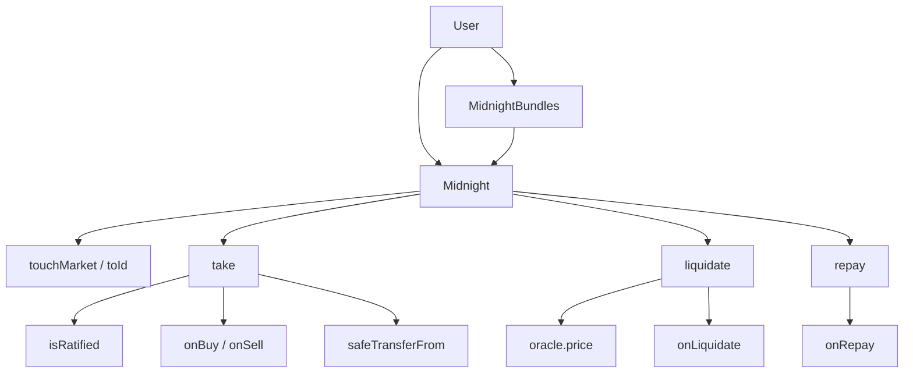

# Source and Test Deep Map

Date: 2026-05-30

## Production `src/` (in scope)

### Core — `src/Midnight.sol`

| Storage | Type | Attack relevance |
|---|---|---|
| `position[id][user]` | `Position` | credit, debt, pendingFee, collateral[128], bitmap |
| `marketState[id]` | `MarketState` | totalUnits, lossFactor, withdrawable, fees |
| `consumed[maker][group]` | `uint256` | offer caps |
| `isAuthorized` | `bool` | delegation |
| `claimableSettlementFee[token]` | `uint256` | fee custody |
| Role addresses | `address` | admin surface |

**State-changing entrypoints:** `take`, `liquidate`, `repay`, `withdraw`, `supplyCollateral`, `withdrawCollateral`, `flashLoan`, `touchMarket`, `updatePosition`, `setConsumed`, `setIsAuthorized`, fee/role setters, `multicall`.

### API — `src/interfaces/`

- `IMidnight.sol` — `Market`, `Offer`, `Position`, `MarketState`, errors
- `ICallbacks.sol` — buy/sell/repay/liquidate/flash magic returns
- `IGate.sol`, `IOracle.sol`, `IRatifier.sol`, `IERC20.sol`

### Periphery — `src/periphery/`

| File | Role |
|---|---|
| `MidnightBundles.sol` | 5 bundle routes; `pullToken`; immutable `MIDNIGHT` |
| `TakeAmountsLib.sol` | assets ↔ units inverse for exact targets |
| `ConsumableUnitsLib.sol` | max consumable units under caps |
| `EcrecoverAuthorizer.sol` | EIP-712 delegated auth helper |

### Ratifiers — `src/ratifiers/`

| File | Role |
|---|---|
| `EcrecoverRatifier.sol` | EIP-712 + Merkle; `cancelRoot` |
| `SetterRatifier.sol` | on-chain root flags |
| `libraries/HashLib.sol` | `hashOffer`, `hashMarket`, Merkle verify |

### Libraries — `src/libraries/`

| File | Role |
|---|---|
| `IdLib.sol` | CREATE2 market bytecode; `toId` full market hash |
| `TickLib.sol` | tick ↔ price |
| `UtilsLib.sol` | mulDiv, bitmap, liquidation lock |
| `SafeTransferLib.sol` | ERC20 transfers |
| `ConstantsLib.sol`, `EventsLib.sol` | constants, events |

## Test map

### Protocol-authored (`test/` excluding `asyam/`)

| File | Covers |
|---|---|
| `BaseTest.sol` | Harness, markets, actors |
| `TakeTest.sol` | take sides, caps, reduceOnly, callbacks |
| `LiquidationTest.sol` | liquidate modes, bad debt, LIF |
| `MidnightBundlesTest.sol` | bundle routes, referral, permits |
| `EcrecoverRatifierTest.sol`, `SetterRatifierTest.sol` | ratification |
| `AuthorizationTest.sol` | `setIsAuthorized` |
| `SettlementFeeTest.sol`, `ContinuousFeeTest.sol` | fees |
| `GateTest.sol` | enter/liquidator gates |
| `FlashloanTest.sol` | flash loan |
| `TakeAmountsTest.sol` | periphery math |
| `IdLibTest.sol`, `TickLibTest.sol`, `UtilsLibTest.sol` | libs |

### Audit harness

| Path | Count | Role |
|---|---|---|
| `test/asyam/poc/PoC_*.t.sol` | 7 | Exploratory attack probes |
| `test/asyam/invariant/Invariant_*.t.sol` | 4 | Accounting/caps/bundle/health |
| `test/asyam/mocks/` | 4 | Reentrant callback, bundle attacker, etc. |
| `test/asyamFindings/` | 14 tests | Validated + live-queue regressions |

### Certora (`certora/specs/`)

| Spec | Bounds |
|---|---|
| `Midnight.spec` | totalUnits, no credit+debt, fee bounds |
| `Solvency.spec` | solvency (CVL market ID summary — see P3-02) |
| `Consume.spec` | consumed caps |
| `Healthiness.spec` | healthy preservation (take filtered) |
| `Liquidate.spec`, `LiquidationBoundedByLIF.spec` | liquidation |
| `LossFactor.spec`, `WithdrawableMonotonicity.spec` | slash, withdrawable |
| `BalanceEffects.spec` | per-entrypoint deltas |
| `Ratification.spec`, `EcrecoverAuthorizer.spec` | auth |
| `CollateralBitmap.spec` | bitmap mirror |

## Call graph (high level)

## PoC file index

| File | Candidate / topic |
|---|---|
| `PoC_TakeCallbackReentrancy.t.sol` | C-14 |
| `PoC_BundleTemporaryBalanceReentrancy.t.sol` | C-26 |
| `PoC_OfferConsumedCapRounding.t.sol` | C-05 |
| `PoC_DeepValidationQueues.t.sol` | C-12, C-29, C-31 |
| `PoC_SignatureMalleability.t.sol` | L-01 |
| `PoC_RoleSetterBricking.t.sol` | P3-01 |
| `PoC_SolvencySpecMarketIdAliasing.t.sol` | P3-02 / C-36 |
