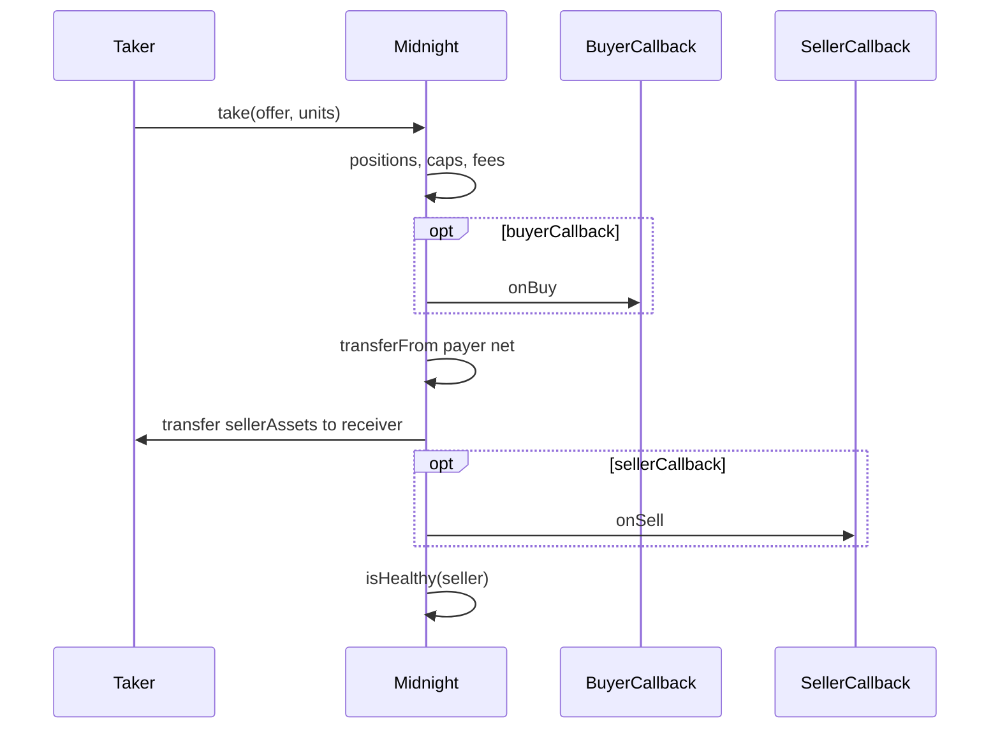
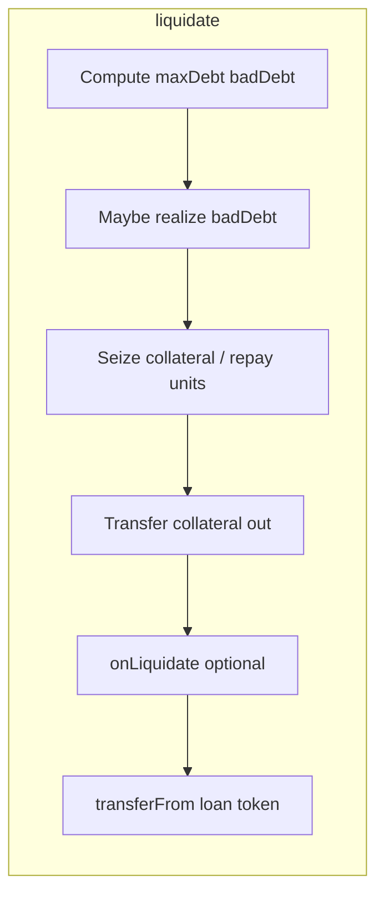

# Asset and Value Flow

Date: 2026-05-30

## take() — loan token

| Step | Detail |
|---|---|
| **Payer** | `buyerCallback` if set, else `(offer.buy ? buyer : msg.sender)` |
| **Receivers** | Midnight (`buyerAssets - sellerAssets` net); `receiver` gets `sellerAssets` |
| **State before transfer** | Positions, `consumed`, `totalUnits`, `claimableSettlementFee` updated |
| **External calls** | `onBuy` → transfers → `onSell` |
| **Reentrancy window** | Between position update and transfers; during callbacks |
| **Invariant** | Net loan token in = increase in custody backing liabilities |
| **Failure** | Insufficient payer balance; unhealthy seller after callbacks |

## supplyCollateral()

| | |
|---|---|
| Payer | `msg.sender` |
| Receiver | Midnight custody |
| State before | Bitmap may activate index |
| Oracle | **Not called** |
| Invariant | Collateral balance increases |

## withdrawCollateral()

| | |
|---|---|
| Receiver | `receiver` |
| State before | Decrease collateral; clear bitmap bit if zero |
| Check | `isHealthy` **after** decrease |
| Invariant | Unhealthy cannot withdraw |

## repay()

| | |
|---|---|
| Payer | `callback` if set else `msg.sender` |
| State before | `debt -= units`, `withdrawable += units` |
| External | `onRepay` **before** `transferFrom` |
| Reentrancy | Callback can reenter; state already reduced debt |
| Invariant | Loan tokens enter custody matching withdrawable increase |

## withdraw()

| | |
|---|---|
| Receiver | `receiver` |
| State | `_updatePosition` first; burn credit; `withdrawable -= units` |
| Transfer | Loan token out |
| Invariant | No over-withdraw |

## liquidate()

| | |
|---|---|
| Out | Collateral to `receiver` |
| In | Loan token `repaidUnits` from payer |
| State | Bad debt branch; optional seize/repay; `withdrawable += repaidUnits` |
| External | `onLiquidate` before loan pull |
| Invariant | Seizure bounded by LIF/LLTV; bad debt consistent |

## flashLoan()

| | |
|---|---|
| Flow | Send loan token → callback → pull back |
| Invariant | Balance restored; magic return |

## Periphery buy flow (units target)

1. Optional Permit2/ERC2612 pull to router.
2. Loop `take` offers; accumulate `filledBuyerAssets`.
3. Pay referral from router balance.
4. Refund excess to user.
5. **`maxBuyerAssets` = total budget** (includes referral).

## Periphery sell flow

1. Supply collateral if needed.
2. Sell offers; loan proceeds to router then user/referral.
3. **Computed** transfer amounts per leg (not `balanceOf` sweep).

## Referral fee flow

- Deducted from buyer spend budget on units-target buys.
- **INTENDED:** reduces net repayment units when repaying via bundle (documented).

## Fee claim flow

- `claimSettlementFee` / `claimContinuousFee` — admin roles; reduce claimable buckets.

## Cross-links

- Periphery: [09_PERIPHERY_BUNDLE_INTENTIONS.md](09_PERIPHERY_BUNDLE_INTENTIONS.md)
- Callbacks: [10_CALLBACK_GATE_ORACLE_TRUST_BOUNDARIES.md](10_CALLBACK_GATE_ORACLE_TRUST_BOUNDARIES.md)
