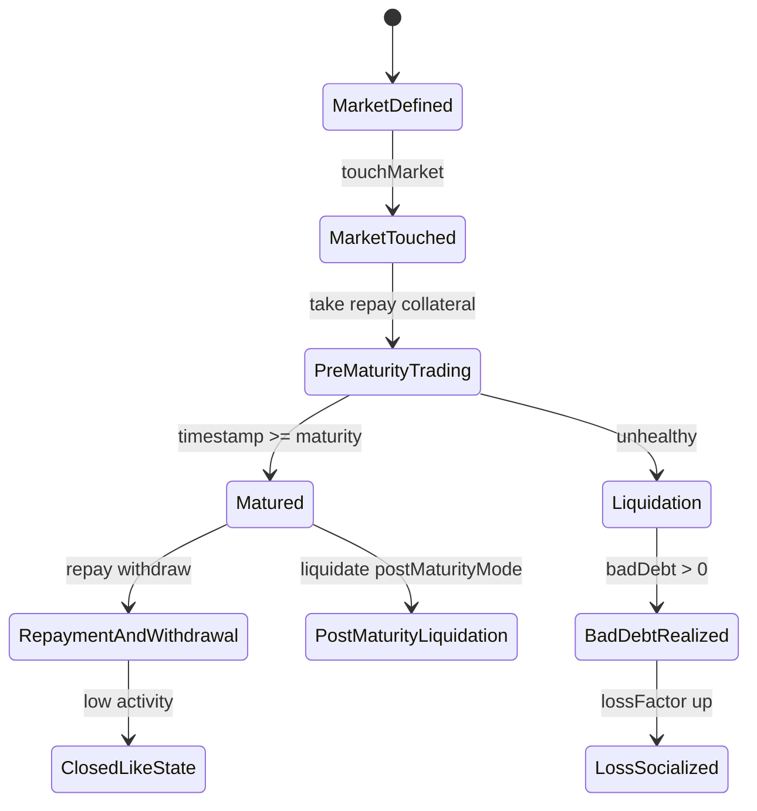

# Market Lifecycle

Date: 2026-05-30

## Creation and identity

- **`touchMarket(market)`** — first interaction deploys market bytecode via CREATE2 (`IdLib.storeInCode`) and initializes `MarketState` (fees, `tickSpacing`).
- **`toId(market)`** — `keccak256(0xff, midnight, chainId, keccak(market))` over **full** encoded `Market` ([`IdLib.sol`](../../../../src/libraries/IdLib.sol)).
- **Immutable parameters:** loan token, collateral params, maturity, gates, `rcfThreshold` fixed at creation.

**Formal model note:** CVL `Solvency.spec::CVL_toId` hashes only `(loanToken, maturity, chainId, midnight)` — **aliases** distinct production markets. See [../06_FORMAL_MODEL_GAP_REVIEW.md](../06_FORMAL_MODEL_GAP_REVIEW.md) (P3-02 formal gap, not production ID collision exploit).

## Collateral parameter model

- Up to **128** collateral entries; sorted by token address.
- Each: `token`, `lltv`, `maxLif`, `oracle`.
- Borrower activates slots via `supplyCollateral` (bitmap, max 128 active).

## Lifecycle state machine

## Phase behaviors

| Phase | Trading | Debt increase | Liquidation |
|---|---|---|---|
| Pre-maturity | Full | Allowed on sell fills | `debt > maxDebt`, not locked |
| At maturity | Fee bucket edge | — | — |
| Post-maturity | Allowed | **Blocked** (`CannotIncreaseDebtPostMaturity`) | `postMaturityMode` rules; LIF decay |

## Market states (economic)

| State | Description |
|---|---|
| No positions | Only fees/defaults; first `take` creates activity |
| Active credit/debt | `totalUnits > 0`, positions open |
| Bad debt | `lossFactor` increased; lenders must `updatePosition` |
| All debt repaid | High `withdrawable`, low debt |
| Lenders withdrawn | `withdrawable` drained; `totalUnits` reflects remaining debt only |

## Intended transitions

- First touch sets default settlement/continuous fees from protocol defaults.
- Repay moves loan tokens into custody → `withdrawable` for lenders.
- Liquidation moves collateral out, loan in, may realize bad debt.
- `lossFactor == max` blocks new `take` (`MarketLossFactorMaxedOut`).

## Bug-candidate transitions

| Transition | Concern |
|---|---|
| Maturity second boundary | Fee bucket flip + debt rule simultaneously |
| Post-maturity liquidate vs take | Inconsistent unit accounting |
| Market created with zero oracle price | Spearbit duplicate — permissionless |
| CVL-aliased markets in proofs | Formal assurance only (P3-02) |

## Cross-links

- [01_ECONOMIC_MODEL.md](01_ECONOMIC_MODEL.md)
- [07_COLLATERAL_HEALTH_AND_LIQUIDATION_MODEL.md](07_COLLATERAL_HEALTH_AND_LIQUIDATION_MODEL.md)
